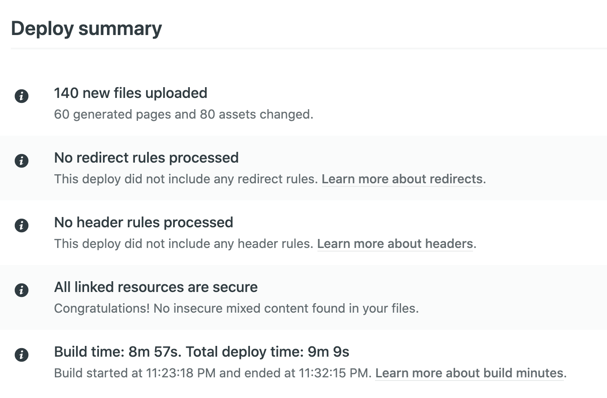
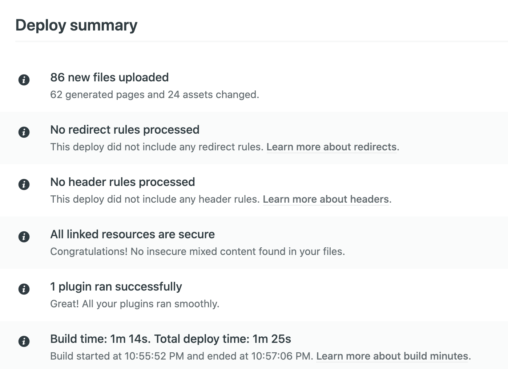
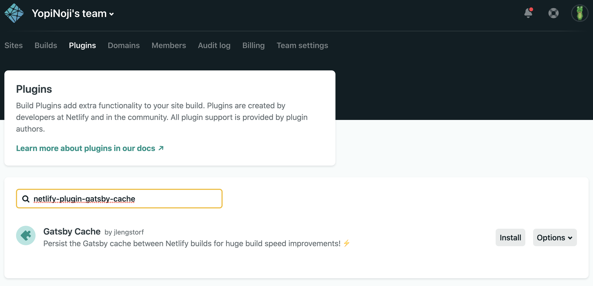

Netlify と Gatsby の構成でウェブサイトを作られている方、こんにちは。

早速ですが結論から言うと、悪いことは言わないから差分ビルド（Incremental Builds）ができるようにした方がいいです。

なぜなら、世界が変わるから。

## 論より証拠

まあ、色々語るより根拠を見せる方が早いです。



上の画像は、差分ビルドを使う前のデプロイの情報です。

注目したいのは、ビルドタイム。  
**ビルドに 9 分近くかかっているのが分かります。**

ただ、10 ヶ月以上も Gatsby を触っている自分としては、Netlify でのビルドにこれくらいの時間がかかるのは当たり前の感覚ではありました。

逆に言うと、その**ビルドタイムの長さが Gatsby の欠点**でもあったのですが。（コンテンツを本番環境に即座に反映できない）

しかし、差分ビルドによりそれは過去のものになりました。  
以下が差分ビルド導入後のビルドタイムです。



**なんと、ビルドタイムが 1 分近くまで短縮されてます！**  
9 分の 1 ですよ！凄すぎる！

もう、これだけで差分ビルドを使わない理由はないと思います。

差分ビルドは使うべきです！

## Netlify + Gatsby の構成への差分ビルドの導入方法

Netlify + Gatsby の構成のブログへの差分ビルドの導入方法は、Netlify 公式から方法がアナウンスされています。  
英語に抵抗のない方は、以下のサイトを参照して導入を進めてください。

https://www.netlify.com/blog/2020/04/23/enable-gatsby-incremental-builds-on-netlify/

当ブログでは、上の情報を元に差分ビルドの導入方法を日本語で記述しておきます。

### Gatsby のバージョンを上げる

公式サイトによると、差分ビルドを行うには v2.20.4 以上のバージョンの Gatsby が必要とのことです。  
古いバージョンを利用している場合は、バージョンアップしておきましょう。

```bash
npm install gatsby@latest
```

全部の npm パッケージのバージョンをあげたい横着な人は、以下のコマンドでも問題ないです。  
（動作確認はした方がいいです）

```bash
npm update
```

### Netlify で差分ビルドのプラグインを有効にする



Netlify 上から差分ビルドのプラグインを有効化します。

プラグインのタブで、`netlify-plugin-gatsby-cache` または `Gatsby Cache` で検索してみてください。

見つけたら、インストールするだけです。

### Gatby のビルド時にプラグインを追加する

`netlify.toml` の上にプラグインを使うことを明記してあげます。

`netlify.toml` はデプロイ時の設定を保存しておけるファイルですね。

```toml
[build]
  publish = "public"
  command = "npm run build"
[[plugins]]
  package = "netlify-plugin-gatsby-cache"

```

上記の内容を参考にして、プラグインを追加してあげてください。

### ビルドスクリプトにプラグインを使うことを明記する

Gatsby のビルドスクリプトには、通常 `gatsby build` を使っているはずです。

このビルドスクリプトに差分ビルドのプラグインを使うことを明記してあげます。  
以下のような感じですね。

```json
"scripts": {
  "build:old": "gatsby build",
  "build": "GATSBY_EXPERIMENTAL_PAGE_BUILD_ON_DATA_CHANGES=true gatsby build --log-pages"
}
```

`--log-pages` のオプションも付けてあげることで、ビルド時のログを追加で見ることができるようになります。  
（ログが不要であれば削除してしまって大丈夫です）

### 実際に Netlify で差分ビルドしてみる

ここまでで Netlify での差分ビルドの設定は完了です。

あとは実際にブログを更新してビルドが走るのを眺めるだけです。
