ブログ記事のヘッダー画像を作成するツールをいくつか試していたのですが、  
その中でも Canva という Web サービスが良かったので、その話です。

## Canva とは？

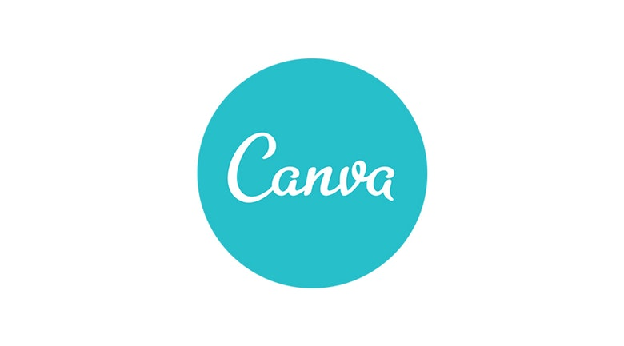

一言で説明すると、インストール不要で Web で使えるデザインツールです。

似ているデザインツールでいうと、Adobe Photoshop や Photoscape などの画像編集ツールに似ていると思います。  
ただ、高機能なツールと言うよりは直感的な操作や使いやすさが特徴で、デザイナー向けと言うよりは万人向けツールです。

Canva 自体は、2012 年にオーストラリアで創業されて、2017 年には日本語版サイトがリリースされています。  
日本語以外にも 25 ヶ国語に対応し、ユーザー数は全世界で 1000 万人以上いるそうです。

自分は主にブログのヘッダー画像作成に使っていますが、  
企業の導入事例を読んでいると、ポスターやロゴ、名刺、広告、ポップ、飲食店のメニューなど様々なデザインワークで使われているようです。  
ロゴやデザインの画像データをクラウド上で保存して共有できるので、チームでデザイン業務をする場面での導入事例もあるようです。

有料プランや有料テンプレートもありますが、基本機能は無料で使うことができます。

また、iOS と Android 向けにアプリが出ているので、スマホから使うこともできます。

個人的に使っていてとても良いと思ったのは、操作が直感的で分かりやすく、なおかつ用途に合わせて簡単に画像が作成できる点です。  
Photoshop など高機能よりな画像編集ツールは、色々と便利な機能が使えて良いとは思うのですが、逆に言うと慣れないと使いづらいところがあると思っています。  
その点**Canva はブラウザ上で直感的に操作でき、それぞれの用途に向いたテンプレートが用意されているので、非デザイナーであってもそこそこオシャレな画像を簡単に作れるところがとても良い**です。

## ヘッダー画像の作り方

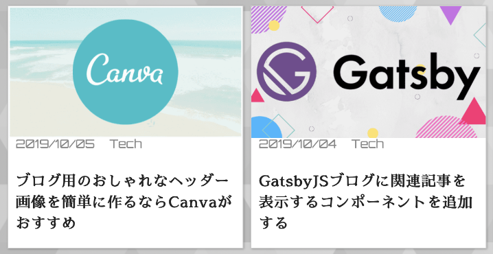

さて、それでは自己流のブログ用ヘッダー画像の作り方について簡単に紹介しようと思います。  
ヘッダー画像とは上記のイメージで使われているような画像のことです。

何はともあれ[Canva公式サイト](https://www.canva.com)から会員登録してログインするところから始めましょう。

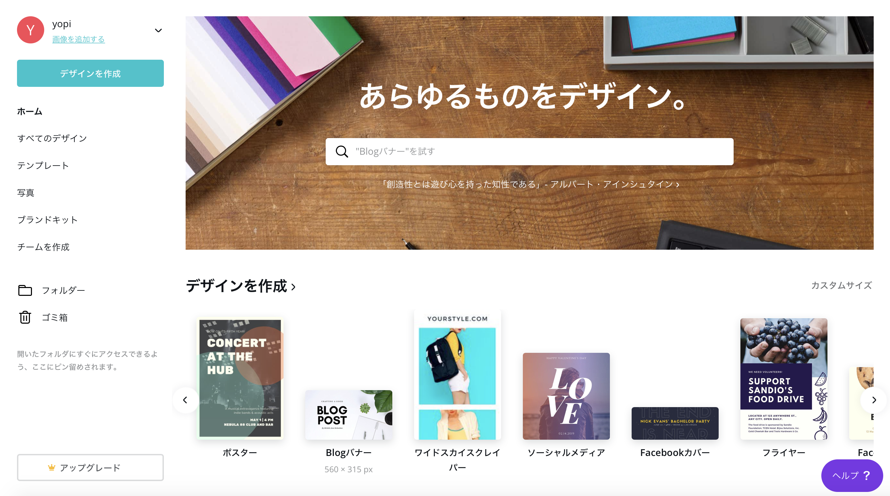

Canva にログインした直後のメニュー画面です。  
左のメニューを見て察する方もいるかと思いますが、一度作成したデザインは保存しておくことが可能です。

デザインを作成する用途によって画像サイズを決めるところから始めます。  
今回は Blog バナーを選択します。

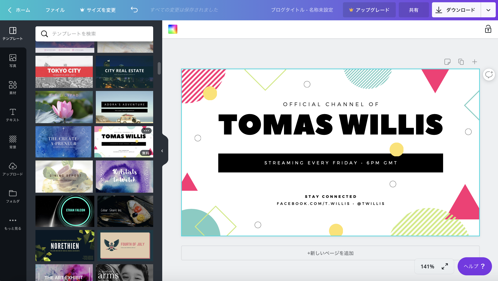

作成するデザインを選ぶと、画像編集できるデザイン用のページに飛ばされます。

ヘッダー画像を作る際に元となるテンプレートが用意されているので、今回はこれを活用します。  
ちなみにテンプレートは有料（1$程度）のものもあるので、無料で使いたい方は無料表記があるものから選びましょう。

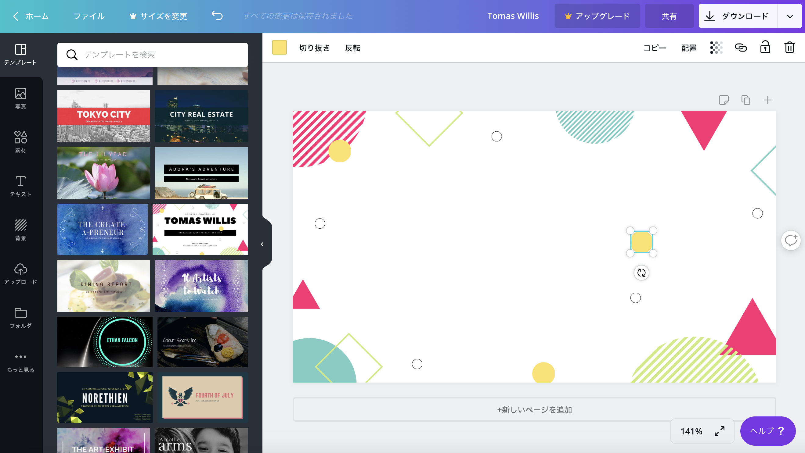

選択したテンプレートから不要な文字を削除していきます。  
要素の削除は、マウスで削除したい要素を選択してキーボードの delete キーを押すだけで簡単に削除できます。  
操作を間違えた場合は、`Cmd + Z`で簡単に元に戻すことができます。  
このような直感的な操作を実現しているところは素直に素晴らしいと思います。

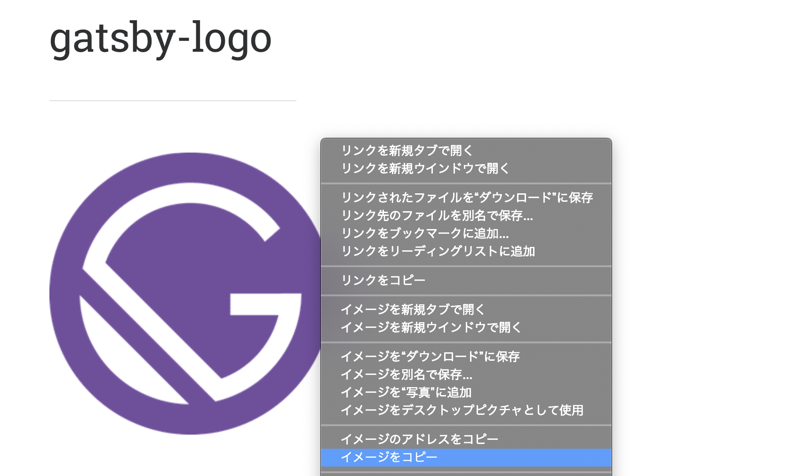

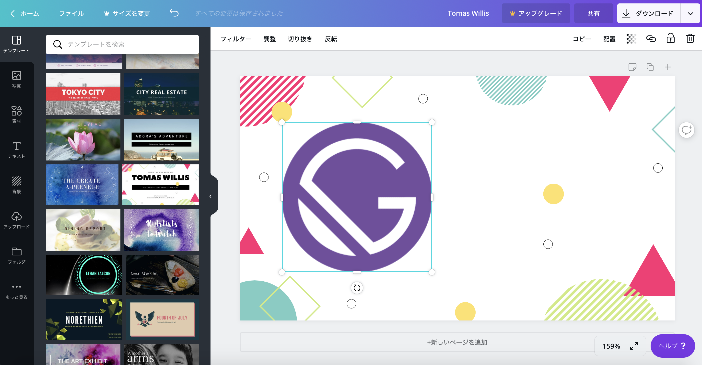

さて、ヘッダー画像で使う Gatsby のロゴを貼り付けていきます。  
Web でロゴを配布しているところから `Cmd + C` でコピーし、Canva に `Cmd + V` で画像をアップロードできます。  
コピー、貼り付け、元に戻すなどの操作は直感的にできるのでとても快適です。

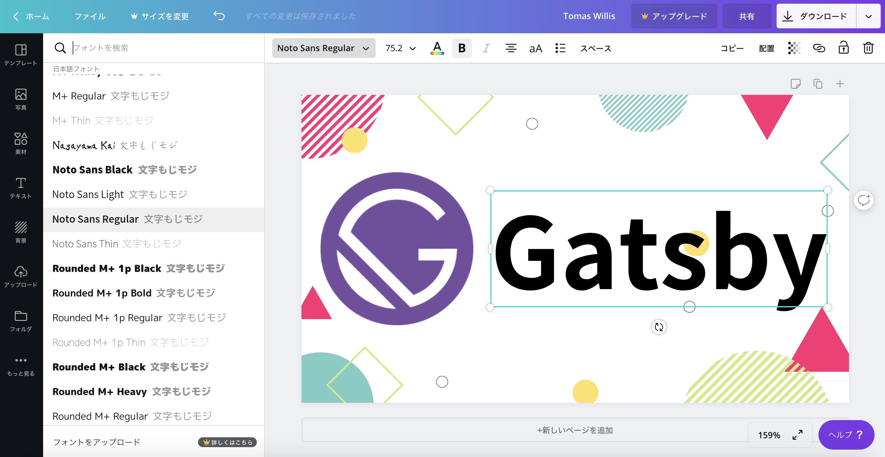

ヘッダー画像にテキストを挿入します。  
フォント、色、サイズなどが設定可能です。  
文字のサイズは数値で設定しなくても、要素の隅をマウスで広げてあげるだけで調整可能です。

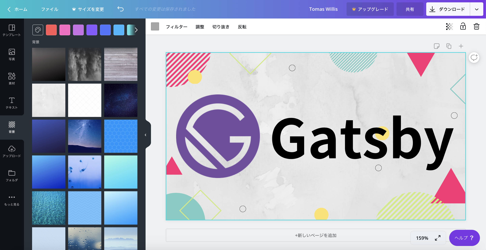

そのままだと味気ない感じがしたので、背景画像を追加してみます。  
背景画像はすでに用意されてあるものから選ぶことができる他、自分が使いたい画像を使うことも可能です。  
カラーパレットから背景画像の色味を調整することも可能です。

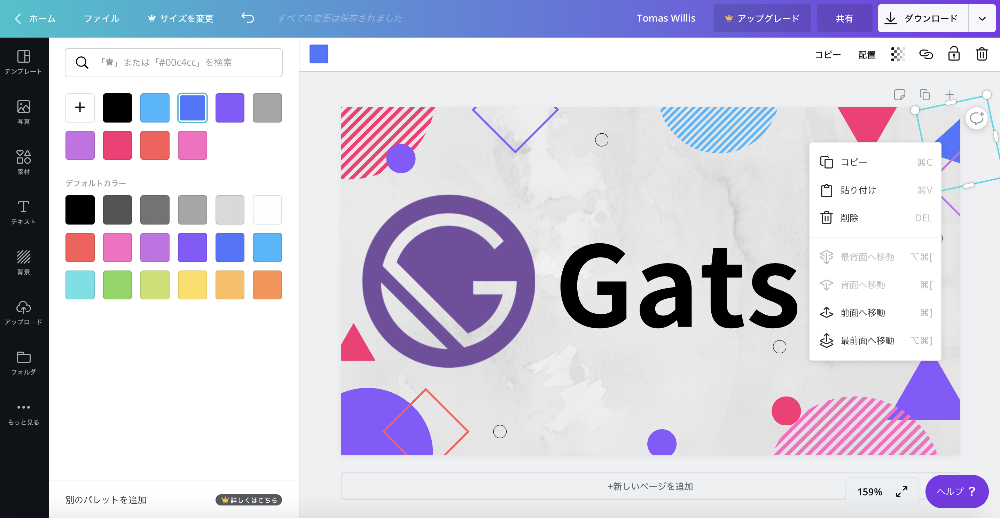

最後に、テンプレートに最初から含まれていた幾何学模様の色や位置を調整します。  
カラーパレットに好きな色を追加するには有料プランが必要なようです。

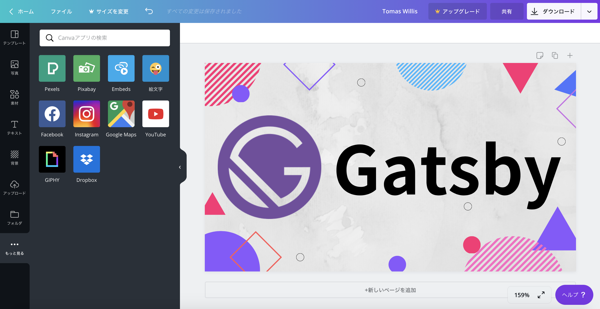

最後にダウンロードしたら、完了です。

さて、どうでしょうか。  
素人がサクッと作ったヘッダー画像にしては、少しはおしゃれに見える（？）画像が作れたのではないでしょうか。

という風に、ここまで説明してきたわけですが、  
自分はまだ Canva の全てを把握しているわけではないので、まだまだ自分の知らない便利な機能があると思います。  
ただ、自分的にはこれだけの機能を Web で簡単に使えれば十分ありがたいです。

## 終わりに

インストール不要で、直感的な操作で、サクサクとストレスなくヘッダー画像が作れるところがとても好きで、  
当ブログの画像編集ではしばらく Canva を使うつもりです。

Photoshop や Photoscape などの高機能でゴツいツールが不要な方には本当におすすめです。

## 参考

[Canva公式サイト](https://www.canva.com)

[Canva - Wikipedia](https://en.wikipedia.org/wiki/Canva)

[無料デザインツールCanvaとは？できることを解説 - サルワカ](https://saruwakakun.com/design/canva/whats)

[Photoshopより簡単、オーストラリア発のデザインツールCanvaが日本上陸 - TechCrunch](https://jp.techcrunch.com/2017/05/24/canva-japan-launch/)
