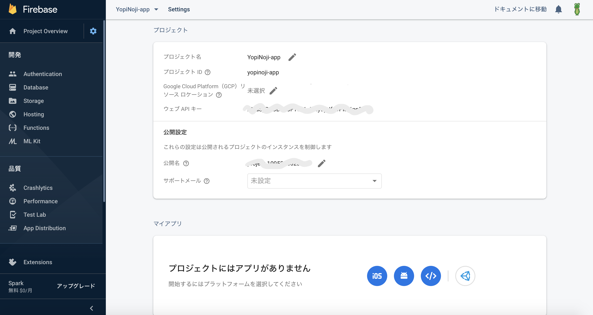
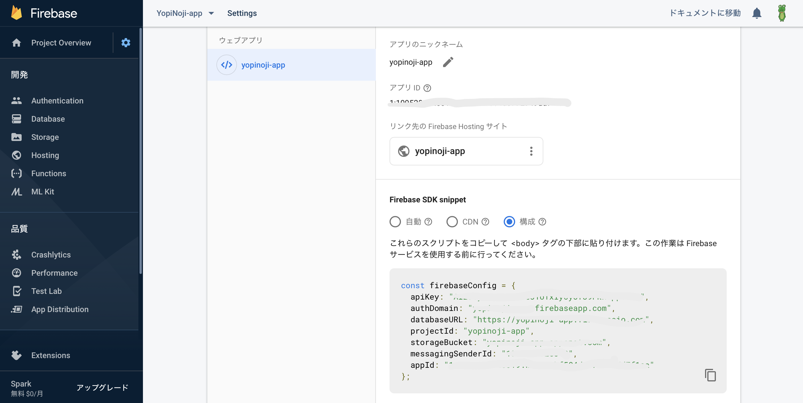
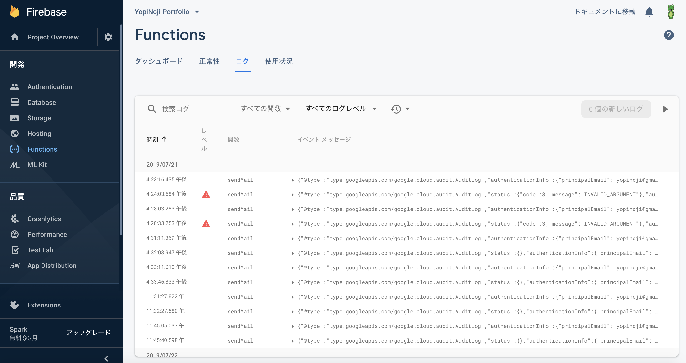

[Nuxt.js と Firebase を使ったポートフォリオサイトの作り方](/getting-started-with-nuxt-js-and-firebase)について以前解説しましたが、  
そのサイトに Firebase Functions を使ったお問い合わせフォームを作成したのでその手順です。

## Firebase Functions とは何か

まず今回使う Firebase Functions ですが、ざっくりと簡単に説明すると「Web サーバー不要なサーバーレスの API を Node.js で作れるよ」というものです。

Firebase の機能のひとつとして Google から提供されています。  
利用する頻度によっては課金が必要になりますが、小規模な個人サイト程度であれば無料で使うことが可能です。

Web サーバー不要なサーバーレスで API を作れるというと AWS の Lambda と API Gateway の組み合わせもありますが、AWS のように 2 つのサービスを組み合わせずに API が作成できるという点で手軽に利用しやすいと思います。

## Firebase Functions をさっそく使ってみる

それではさっそく使ってみましょう。  
なお、Firebase の初期設定やベースとなるサイトについては[以前の記事](/getting-started-with-nuxt-js-and-firebase)を参照してください。

まず最初に Firebase Hosting を使った時と同じように `firebase init` コマンドで設定ファイルを生成します。

```bash
$ npm run firebase init
```

矢印キーとスペースキーで Functions を選んで、エンターキーで次に進みます。

```bash

     ######## #### ########  ######## ########     ###     ######  ########
     ##        ##  ##     ## ##       ##     ##  ##   ##  ##       ##
     ######    ##  ########  ######   ########  #########  ######  ######
     ##        ##  ##    ##  ##       ##     ## ##     ##       ## ##
     ##       #### ##     ## ######## ########  ##     ##  ######  ########

You're about to initialize a Firebase project in this directory:

  /Users/yopinoji/Workspace/nuxt-js-portfolio

Before we get started, keep in mind:

  * You are initializing in an existing Firebase project directory

? Which Firebase CLI features do you want to set up for this folder? Press Space
 to select features, then Enter to confirm your choices.
 ◯ Database: Deploy Firebase Realtime Database Rules
 ◯ Firestore: Deploy rules and create indexes for Firestore
❯◉ Functions: Configure and deploy Cloud Functions
 ◯ Hosting: Configure and deploy Firebase Hosting sites
 ◯ Storage: Deploy Cloud Storage security rules
```

セットアップの際に、「JavaScript を使うのか TypeScript を使うのか」「ESLint を使うのか」など色々と聞かれますが、自分の好きなようにしてしまって問題ないです。

```bash
=== Functions Setup

A functions directory will be created in your project with a Node.js
package pre-configured. Functions can be deployed with firebase deploy.

? What language would you like to use to write Cloud Functions? JavaScript
? Do you want to use ESLint to catch probable bugs and enforce style? Yes
? File functions/package.json already exists. Overwrite? Yes
✔  Wrote functions/package.json
? File functions/.eslintrc.json already exists. Overwrite? Yes
? File functions/index.js already exists. Overwrite? Yes
✔  Wrote functions/.eslintrc.json
✔  Wrote functions/index.js
? File functions/.gitignore already exists. Overwrite? Yes
✔  Wrote functions/.gitignore
? Do you want to install dependencies with npm now? Yes
```

セットアップが完了すると作業ディレクトリに `functions` というフォルダができているかと思いますが、そのフォルダが Firebase Functions の開発で使う作業フォルダになります。

## お問い合わせ内容をメールで転送する API を作る

`functions`フォルダにある `index.js` を下記に書き換えてください。

```javascript
const functions = require("firebase-functions");
const nodemailer = require("nodemailer");
const gmailEmail = functions.config().gmail.email;
const gmailPassword = functions.config().gmail.password;
const gmailDestination = functions.config().gmail.destination;
const mailTransport = nodemailer.createTransport({
  host: "smtp.gmail.com",
  secure: true,
  auth: {
    user: gmailEmail,
    pass: gmailPassword
  }
});

exports.sendMail = functions.https.onCall((data, context) => {
  const email = {
    from: gmailEmail,
    to: gmailDestination,
    subject: data.form.subject.contents,
    text:
      data.form.message.contents +
      "\n" +
      "Email:" +
      data.form.email.contents +
      "\n" +
      "Name:" +
      data.form.name.contents
  };
  mailTransport.sendMail(email, (err, info) => {
    if (err) {
      return console.log(err);
    }
    return console.log("success");
  });
});
```

ソースについて軽く解説すると、`nodemailer`という Node.js でメールを送信するための npm パッケージがあるので、  
それを用いて Gmail のアカウントを使いお問い合わせ内容をメールで転送します。

Gmail アカウントの ID と Password はソースに直書きだとまずいので、Firebase の環境変数として登録しておきます。  
こうすることで Firebase にログインできない限り、Gmail アカウントの ID と Password を隠蔽できます。

環境変数に設定するには Firebase の開発環境から CUI でコマンドを入力することで行えます。  
あらかじめログインしておく必要があるので、ログインがまだの場合は前回の記事を参考にしてログインしてみてください。

環境変数への設定は以下のコマンドで行います。  
`gmail.email`と `gmail.password` にはメール転送に使う Gmail アカウントの情報を、`gmail.destination`にはメールの転送先のメールアドレスを入れます。

```
$ npm run firebase functions:config:set gmail.email="from@gmail.com" gmail.password="yourpassword" gmail.destination="to@gmail.com"
```

ここで気をつけてほしいのが、メール転送に使う Gmail アカウントは Firebase の API からログインする都合で Google アカウントのセキュリティレベルを落とさざるを得ません。  
そのため、この方法を使う場合、転送専用の Gmail アカウントを使うことをお勧めします。  
なお、転送されたメールを受信する側についてはセキュリティレベルを下げる必要はないので、こちらは普段使っているメールアドレスで問題ないです。

環境変数への設定ができたら、ちゃんと設定できているのか確認しておきましょう。  
Firebase Functions の環境変数を取得するには、以下のコマンドを実行します。

```bash
$ npm run firebase functions:config:get
```

設定に問題なければ以下のような JSON 形式で環境変数が返ってきます。

```json
{
  "gmail": {
    "email": "from@gmail.com",
    "password": "yourpassword",
    "destination": "to@gmail.com"
  }
}
```

最後に依存ライブラリ（nodemailer）をインストールしておきます。

```bash
$ npm install nodemailer
```

これで Firebase Functions を使い、お問い合わせ内容をメールで転送する API の作成はほぼ完成です。

## Nuxt.js で Firebase Functions を使う画面を作る

次は API にお問い合わせ内容を送るための画面を Nuxt.js(Vue.js)で作っていきます。

画面を作る前に、Nuxt.js アプリから Firebase Functions を簡単に利用するための設定ファイルを作っていきます。

まず、Nuxt.js で `.env` を使えるようにするためのライブラリをインストールします。

```
$ npm install @nuxtjs/dotenv
```

ついでに、Firebase に Nuxt.js アプリから簡単にアクセスするためのライブラリをインストールしておきます。

```
$ npm install firebase
```

Nuxt.js で `.env` を使うためのライブラリをインストールできたら、`nuxt.config.js`に以下 2 つ記載を追記してあげます。

```
plugins: [
  '~/plugins/firebase.js'
]
```

```
modules: [
  '@nuxtjs/dotenv'
]
```

次に、Nuxt.js プロジェクトの `plugins` フォルダに `firebase.js` を作成します。

```javascript
import firebase from "firebase";

const config = {
  apiKey: process.env.FB_API_KEY,
  authDomain: process.env.FB_AUTH_DOMAIN,
  databaseURL: process.env.FB_DATABASE_URL,
  projectId: process.env.FB_PROJECTID,
  storageBucket: process.env.FB_STORAGE_BUCKET,
  messagingSenderId: process.env.FB_MESSAGING_SENDER_ID
};

if (!firebase.apps.length) {
  firebase.initializeApp(config);
}

export default firebase;
```

最後に、上記の `firebase.js` で使用する `.env` を作成します。  
雛形は以下を使ってください。

```
FB_API_KEY = ''
FB_AUTH_DOMAIN = ''
FB_DATABASE_URL = ''
FB_PROJECTID = ''
FB_STORAGE_BUCKET = ''
FB_MESSAGING_SENDER_ID = ''
```

「API のキーなどはどこから取得できるのか」という件については、Firebase から取得する必要があります。



上記の Firebase プロジェクトの設定画面に行くと、「プロジェクトにはまだアプリがありません」と出ている箇所があります。

Firebase Hosting だけの利用だとここにアプリを作成する必要はなかったのですが、  
Firebase Functions などを使う際に Firebase の npm ライブラリを使う場合はここでアプリを作成する必要があるみたいです。

そのため、アプリを作成してあげてください。
なお、アプリを作成する際に Firebase Tools のインストールなど色々出てきますが、[以前の記事](/getting-started-with-nuxt-js-and-firebase)から続けている方はすでに設定済みなので読み飛ばしてしまって問題ありません。



アプリを作成すると上記のようにキー情報が入手できるので、これを先ほどの `.env` に貼ってください。

さて、Nuxt.js 側の設定が一通り終わったら、画面を作っていきます。  
お問い合わせフォームは以下のようなコンポーネントにします。

```javascript
<template>
  <div class="contact">
    <form>
      <div class="contact-form">
        <input
          v-model="form.name.contents"
          class="contact-form-text"
          type="text"
          placeholder=""
        />
        <label class="contact-form-label">Name</label>
      </div>
      <div class="contact-form">
        <input
          v-model="form.organization.contents"
          class="contact-form-text"
          type="text"
          placeholder=""
        />
        <label class="contact-form-label">Organization</label>
      </div>
      <div class="contact-form">
        <input
          v-model="form.email.contents"
          class="contact-form-text"
          type="email"
          placeholder=""
        />
        <label class="contact-form-label">Email</label>
      </div>
      <div class="contact-form">
        <input
          v-model="form.subject.contents"
          class="contact-form-text"
          type="text"
          placeholder=""
        />
        <label class="contact-form-label">Subject</label>
      </div>
      <div class="contact-form">
        <textarea
          v-model="form.message.contents"
          class="contact-form-textarea"
          type="textarea"
          placeholder=""
        />
        <label class="contact-form-label">Message</label>
      </div>
      <div class="contact-form">
        <button class="contact-form-button" type="button" @click="sendMail()">
          Send
        </button>
      </div>
    </form>
  </div>
</template>

<script>
import firebase from '~/plugins/firebase.js'

export default {
  data: () => ({
    form: {
      name: { contents: '' },
      organization: { contents: '' },
      email: { contents: '' },
      subject: { contents: '' },
      message: { contents: '' }
    }
  }),
  methods: {
    sendMail() {
      const form = this.form
      const sendMail = firebase.functions().httpsCallable('sendMail')
      sendMail({ form })
        .then((response) => {
          alert(response)
        })
        .catch((error) => {
          alert(error)
        })
    }
  }
}
</script>

<style scoped></style>
```

お問い合わせ内容をシンプルに送信するだけのフォームです。  
送信前のバリデーションは行っていませんが、もし必要であれば自分の GitHub にあるソースを参考にして追加してください。

## 実際に動かして確認する

最後に、作成したお問い合わせフォームを実際に確認します。

```bash
$ npm run generate
```

```bash
$ npm run firebase deploy
```

実際にデプロイしてお問い合わせフォームを動かして問題なければ完了です。

もし、お問い合わせフォームが動かないなど問題がある場合、ログを見ながら進めると解決できるはずです。
ログについては、Firebase の Web 上から確認できます。



お問い合わせ送信用の API にログ関数を仕込んで色々と試してみてください。

## 終わりに

Web サーバーを用いないサーバーレスの構成で、ここまで実装を行うことができる Firebase は本当に便利です。  
Firebase 上の他のサービスも活用することでもっと深いところまで作れると思うので、是非試してみてください。

## 参考

[Firebase 　公式](https://firebase.google.com)
