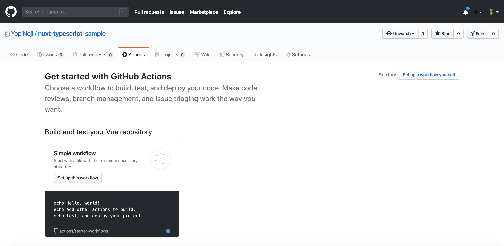
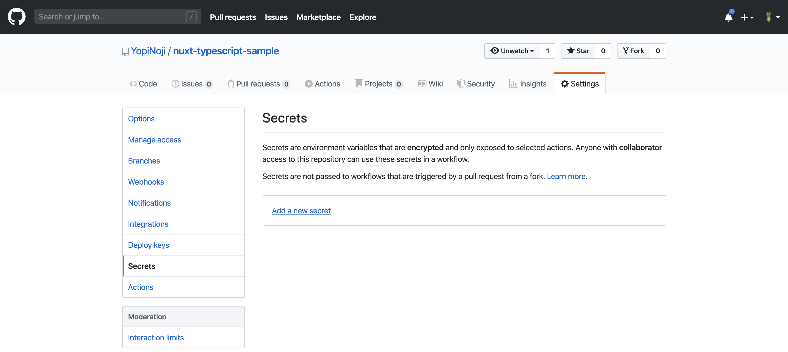

GitHub 謹製の CI ツール、GitHub Actions をご存知でしょうか？
まだ正式リリースされてから半年程度なので知らない人も多いかと思いますが、実際に使ってみて超便利だと思ったのでメモしておきます。

## GitHub Actions で何ができるの？

Github の特定のブランチへの更新などをトリガーにして、色々なアクションを起こせる GitHub の機能です。

- ESLint でソースコードをチェックする
- AWS S3 に生成物をコピーする
- Jest でテストする

上記などのことを GitHub 上で行うことができるようになります。

これまではこうしたことを実行するには、Jenkins や Travis CI、Circle CI などの外部サービスにつなぐ必要があったのですが、GitHub 上で全て完結するところに強みがあると言えます。

また、触ってみた感想ですが、割と簡単な記述で CI を動かせるのはかなり魅力だなと思いました。

## GitHub Actions を使えるようにする前の下準備

今回 GitHub Actions を用いて、AWS S3 にデプロイする対象として、Nuxt.js により生成した静的サイトを用いようと思います。  
そのための下準備として以下が必要になります。

- AWS CLI を動かすためのアクセスキーを IAM から発行する
- Nuxt.js でプロジェクトを作る
- GitHub にリポジトリを作る
- Github Actions での処理のフローを書いた yml ファイルを作る
- 実際に GitHub にプッシュするなどして GitHub Actions を動かす

上記のフローについて詳しく書いても良いのですが、本題と外れるので今回は省きます。

## Nuxt.js により生成された静的サイトを AWS S3 にデプロイする

さて、ここからが本題です。



対象の GitHub リポジトリを開き、Workflow をセットアップします。

今回は特に何でもいいので、一番上に出ている Simple Workflow を選んでおきます。

yml ファイルには以下を記入します。

```
name: Deploy to AWS S3

on:
  push:
    branches:
      - master
      - release/**

env:
  project-name: Nuxt.js Project

jobs:
  deploy:
    name: Build & Deploy
    runs-on: ubuntu-latest
    steps:
      - name: Checkout
        uses: actions/checkout@v2

      - name: Setup Node
        uses: actions/setup-node@v1
        with:
          node-version: 12.x

      - name: Package Install
        run: npm install

      - name: Build
        run: npm run generate

      - name: Publish to AWS S3 & CloudFront Cache Clear
        uses: opspresso/action-s3-sync@master
        env:
          AWS_ACCESS_KEY_ID: ${{ secrets.AWS_ACCESS_KEY_ID }}
          AWS_SECRET_ACCESS_KEY: ${{ secrets.AWS_SECRET_ACCESS_KEY }}
          AWS_REGION: 'ap-northeast-1'
          FROM_PATH: './dist'
          DEST_PATH: 's3://targetS3bucket/'
          OPTIONS: "--acl public-read --delete"

```

上記の yml ファイルについて簡単に解説します。

まず、GitHub の `master`、または `release` ブランチへのプッシュをトリガーにアクションを起こします。
アクションは `job` と書かれているところ以下に記載されています。

アクション自体は、Linux Ubuntu 上で動いています。

`actions/checkout@v2` でプッシュした Git リポジトリをチェックアウトしています。

`actions/setup-node@v1` で Node.js をセットアップしています。  
そして、`run` と書かれているところに記載のある npm script を実行して、Nuxt.js で静的サイトをビルドしています。

最後のフロートして、`opspresso/action-s3-sync@master` を用いて生成された静的サイトを AWS S3 の `targetS3bucket` にデプロイしています。

AWS のアクセスキーは、yml ファイルに直書きでも動くのですがセキュリティ的に危ないので「Settings > Secrets」から登録したアクセスキーを呼び出すことで使っています。



上記の画面から秘密にしておきたい認証情報を GitHub 上で登録できます。

以上が今回用いた yml ファイルについての簡単な解説です。

これを使えば、GitHub Actions を使ってリポジトリの更新をフックして AWS S3 にファイルをアップロードするフローを実現できます。

（ただ、最近出たばかりなので、どんどん仕様が変わっていくかもしれない点に留意した方が良い気がします）
