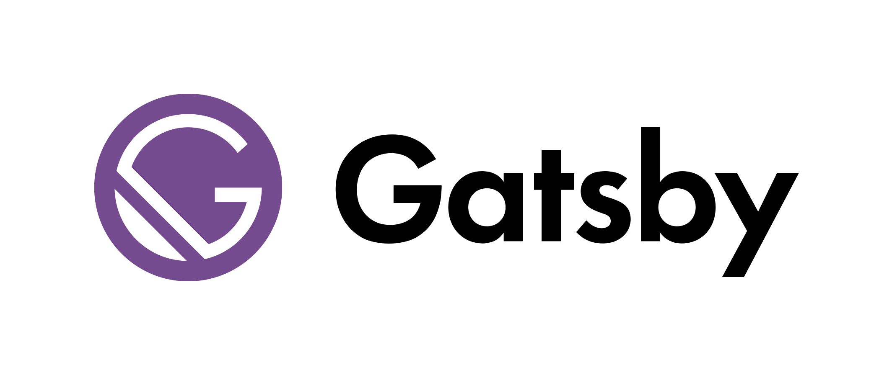
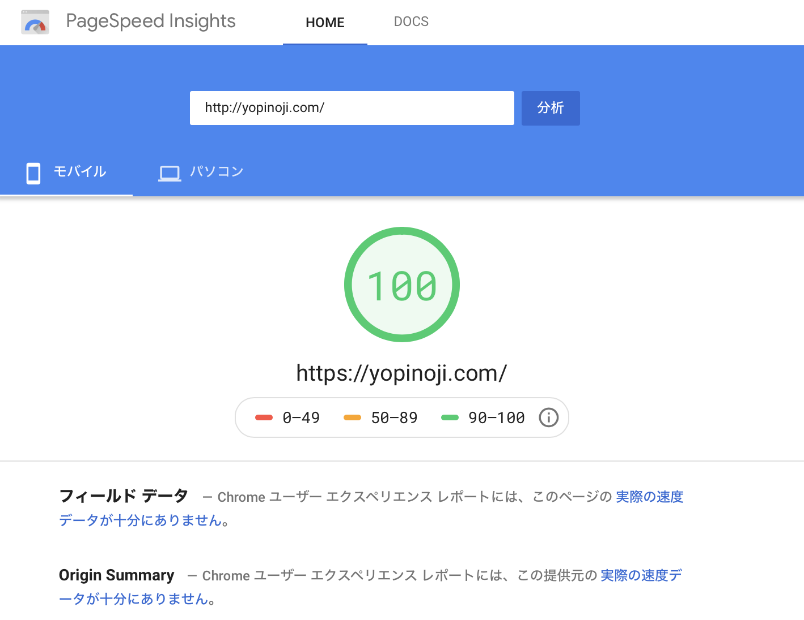

Gatby という React 製の静的サイトジェネレーターを使って、ブログを作ってみたのでその話。

## Gatsby とは何か

そもそも Gatsby って何なのかと言うことについてですが、  
簡単に言うと、HTML/CSS/JavaScript などのウェブサイトを表示する際に必要な静的サイトを生成してくれるツールです。  
そして、その生成された静的サイトを特定の URL にホスティングすることでウェブサイトを作ることができるわけです。

多くのウェブサイト構築に使われている WordPress では、ページにアクセスがあった際に Web サーバーが処理を行い動的にページを表示しています。  
このようにアクセスした状況に応じて異なる内容のページを表示するウェブサイトを動的サイトと呼びます。  
一方で Gatsby はウェブサイトとして表示可能なファイルを生成します。  
生成されたファイルは動的にデータを読み込むことなどしません。したがって何度開き直しても同じ内容が表示されます。  
こうしたウェブサイトを静的サイトと呼びます。

今回自分の作成したブログの構成では、Markdown で記事を作成してそこからデータを取得するようにし、Markdown で作られた記事を Git で管理するようにしています。  
静的サイトの配信には Netlify を用いており、記事を管理している Git のリポジトリが更新されるたびに静的サイトを自動で生成して配信するように設定しています。

自分は試していないので詳細は語れないのですが、WordPress で作成した投稿データを用いて Gatby で静的サイトを生成することも可能なようです。  
他にも、Contentful などのヘッダレス CMS と呼ばれるサービスからのデータ取得にも対応しているようです。

Gatsby では、サイト表示する部分に React を使っていたり、書いた記事を取ってくる部分に GraphQL を使っていたりと先進的な作りになってます。  
個人的に、触っていてとても楽しいですし、何より勉強になります。

## なぜ Gatsby なのか

さて、今回 Gatsby を使ってブログを作ってみました。  
世の中、ブログを作る方法は色々あると思います。  
無料ブログ作成サイトから作る方法、WordPress で作る方法、ヘッダレス CMS を使う方法など、本当に様々な方法があると思います。  
その中でなぜ Gatsby なのかについてですが、理由としては下記の 3 つになります。

- カスタマイズ性が高い
- 低コストで運営できる
- パフォーマンスが良い

上記について、順を追って説明していきます。

### カスタマイズ性が高い

せっかくブログを作るんだから、自分仕様にカスタマイズしたい。  
そんな方も多いと思います。かく言う自分もカスタマイズしたい派の人間です。

細かいカスタマイズが可能なブログを作る際に、一般的によく使われるのが WordPress だと思います。  
ただ、今回 Gatsby を触った感じでは、WordPress と同等の機能を取り込んだブログを作ることが Gatsby においても可能だと感じています。

自分が今回ブログを作る際には、以下を満たせるものを作りました。

- 独自ドメインの設定が可能
- デザインのカスタマイズが自由に可能
- 記事を Markdown で編集可能
- カテゴリーやタグなどの機能追加できる
- 固定ページの作成ができる
- RSS フィード

今回自分がブログ構築した際、Gatsby には上記を満たすための機能が揃っていたか、あるいは自分で機能追加することで対応できました。  
カスタマイズ性高いです。

ただ 1 つだけ壁がありまして、Gatsby を使ったサイトをカスタマイズする際には、React や GraphQL の知識が必要になります。  
WordPress のようにプラグインのインストールだけで簡単にカスタマイズとはいかないのでハードルが少し高いかもしれません。

裏を返せば、React を勉強してる人や React が書ける人にとっては面白いツールだと思います。  
（ちなみに自分は React 勉強中です）

### 低コストで運営できる

サイト運営で維持費を気にされる方は多いのではないでしょうか。  
お金のかかりそうな項目を考えてみましたが、それなりのサイトを作ろうとすると出費はどうしてもかかるものです。

- 独自ドメインの維持費
- 月々のサーバー料金
- 無料ブログの有料プラン

特にブログを始めたばかりの場合などブログを続けていけるかも分からない状況では、こうした出費をなるべくかけたくないと思います。

それでは Gatsby はどうなのかと言う話ですが、結論から言うと自分の場合は独自ドメインの維持費のみで済んでいます。  
ドメインの維持費は年間で 1500 円ほどです。月々に換算すると 125 円ほどです。安いです。  
（ちなみに自分は以前 WordPress 製のブログをレンタルサーバーで動かしていましたが、その際は月々1500 円ほど維持費が必要でした）

なぜこんなに安いのかと言うと、Gatsby で生成した静的サイトをホスティングするだけでいいからです。  
データベースや Web サーバーを用意する必要はありません。  
幸いなことに静的なサイトをホスティングするだけのサービスでは独自ドメインを設定したとしても、大抵は無料の枠組みの中で運用できます。  
つまり、独自のドメインが不要な場合は、無料で運用することも可能です。

自分が把握している範囲のホスティングサービスは以下になります。  
興味があれば検索してみてください。

- Netlify
- Firebase
- GitHub Pages
- Google App Engine
- AWS S3

また、個人サイトの規模だとあまり気にしないかもしれませんが、  
セキュリティという観点において、データベースや Web サーバーが存在しないため、不正アクセスやデータ改ざんをあまり気にする必要がないのは静的サイトの強みですね。

### パフォーマンスが良い

上記の画像は、今回作成したサイトを [Google PageSpeed Insights](https://developers.google.com/speed/pagespeed/insights/) でサイト表示スピードを数値化してみたものです。  
WordPress のサイトの場合、色々と調整しないと高得点が出せなかった記憶があるのですが、Gatsby 製のサイトでは何も考えずとも 100 点を出せたのは正直驚きました。

Web サーバーを使う動的なウェブサイトでは、ページへのアクセスがあった際に、Web サーバーで処理をしたのちにページを表示しますが、  
Gatsby で生成された静的なサイトで構築したウェブサイトは、すでに生成されてあるファイルを返すだけなので基本的にかなり早いです。

また、生成されたサイトは画像や SEO など Gatsby が最適化してくれているため、  
最適な状態なウェブサイトをサクサクと高速で表示できます。

例えば、画像の読み込みには gatsby-image というプラグインを使うのですが、  
これを使って読み込むだけで画像サイズ最適化・遅延読み込み・読み込み順の最適化などを行ってくれます。

また、サイト表示のパフォーマンスとは直接関係ありませんが、Gatsby 製のサイトの場合は Raect によりシングルページアプリケーション（SPA）として構築されるので、  
ページを遷移する際の移り変りをスムーズに行えてユーザ体験として良いものを提供できるところは好きですね。

## 終わりに
今回 Gatsby を用いてブログを構築してまだ間もないですが、  
Gatsby だけで今まで WordPress などで構築していたウェブサイトが一部代替できそうなところにとても魅力を感じています。

もちろん、Gatsby は万能ではありません。  
静的なサイトに特化しているため、会員登録やログインといった動的な機能を持ったウェブサイトの構築には不向きです。

また、静的サイトジェネレーターについては、Gatsby 以外にも有名なツールがいくつもあるのでそちらについても調べてみると面白いかもしれません。

本記事を読んで Gatsby に興味を持たれた方はぜひ公式チュートリアルを読んで試してみてください。

## 参考

[Gatsby公式](https://www.gatsbyjs.org)

[React用静的サイトジェネレータのGatsbyJsでブログを構築した](https://tsukamon.com/blogs/2)
