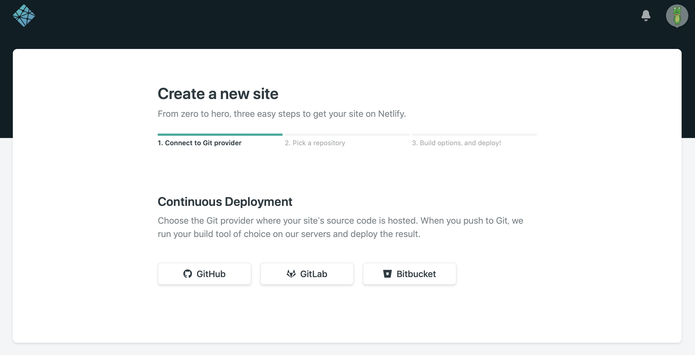
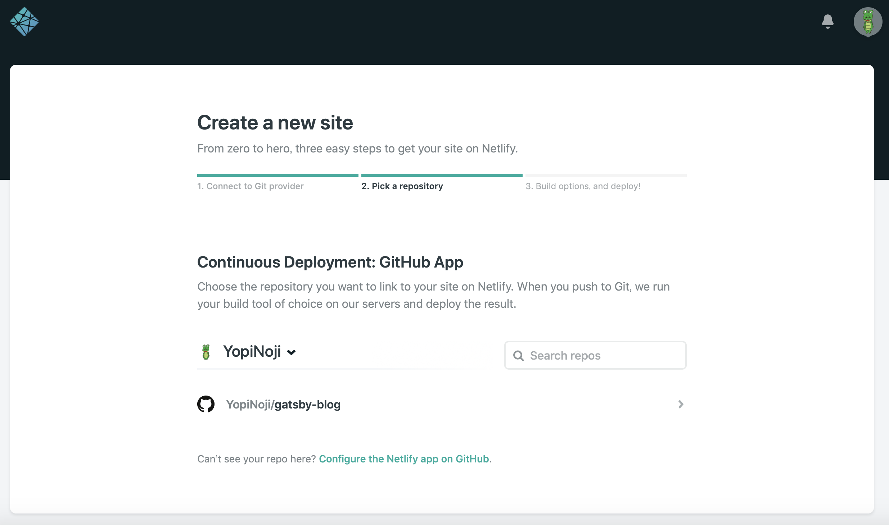
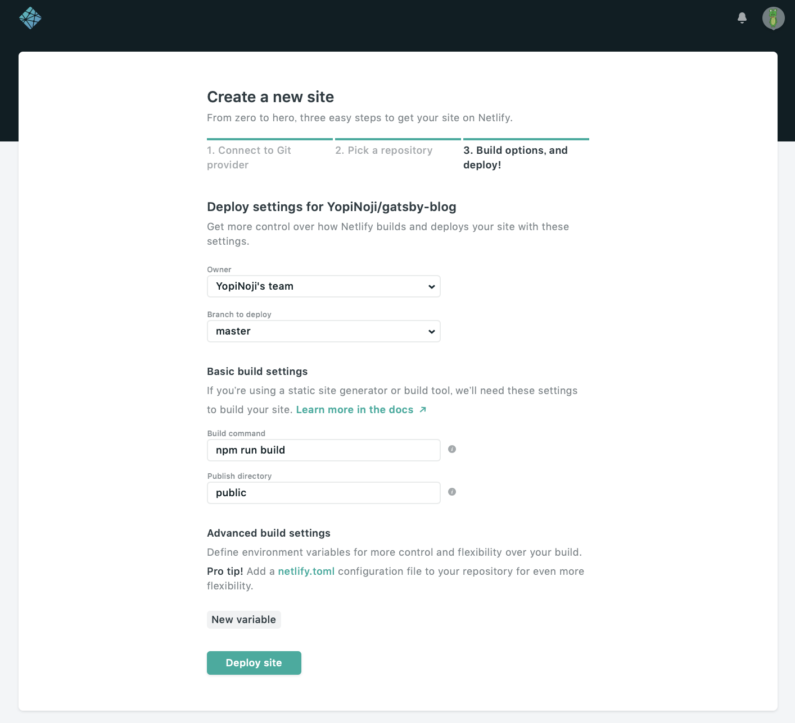
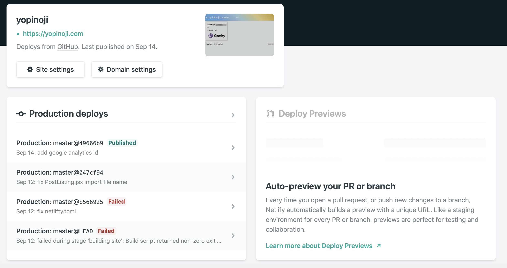

Gatby で作ったサイトを公開する際に、使うサービスとして[Netlify](https://www.netlify.com)がおすすめという話です。

実際に当サイトも[Netlify](https://www.netlify.com)を使って公開していますが、とても便利だと感じています。

## Netlify とは？

静的サイトを配信する環境を提供している Web サービスです。  
大きな特徴は以下になります。

- GitHub と連携してビルド＆デプロイを自動で行ってくれる
- SSL 証明書が無料（独自ドメインを HTTPS で使える）
- デフォルトで CDN によりキャッシュされて高速配信可能（日本にも CDN サーバーあるみたい）
- ストレージは 100GB まで無料
- データ転送量は月 100GB まで無料

何がすごいと言えば、やはりこれだけ色々とできるのに無料で使えるところです。  
有料プランもありますが、個人利用なら無料プランで十分だと思います。

また、他の静的サイトホスティングサービスでは自動ビルド＆デプロイまでしてくれないところが多いので、  
個人的には「GitHub と連携してビルド＆デプロイを自動で行ってくれる」ところがとても便利だと感じています。

## Netlify の使い方

まず、今回の使い方では、GitHub にソースコードをプッシュするたびに  
Netlify で最新の状態でビルドしてサイトを配信するという使い方の解説していきます。

そのために、以下のものが必要になります。

- GitHub アカウント
- GitHub で管理している Gatsby のリポジトリ

GitHub の用意できたら、まず[Netlify](https://www.netlify.com)にログインします。  
GitHub アカウントを使ってログインできるので、メールで登録せずにログイン可能です。

ログインできたら、[New site from Git](https://app.netlify.com/start)という項目から新しくサイトを作っていきます。  
この際に、Continuous Deployment で GitHub を選んでおきましょう。  
GitHub の他にも GitLab や Bitbucket といった他の Git リポジトリ管理サービスとの連携も可能です。

次に Netlify で配信するサイトの Git リポジトリを選択します。

NetLify と GitHub を連携しているのに GitHub リポジトリが表示されない場合は、[Configure the Netlify app on GitHub](https://github.com/settings/installations)から Git リポジトリへのアクセス権の設定を確認しましょう。  
個別のリポジトリごとにアクセス許可を出している場合は、上記の画面で表示されないことがあります。

最後にビルドとデプロイの設定です。  
上記の画像の場合、選択した Git リポジトリ master ブランチに更新があった場合に、  
Netlify は `npm run build` というコマンドを実行し、  
その結果として生成された public フォルダの中身を Web 上にホスティングしてくれます。

また、netlify.toml というファイルを Git リポジトリに追加することで、  
ビルドする際にカスタム設定を用いることも可能です。
ちなみに netlify.toml がすでに Git リポジトリに存在する場合は、netlify.toml の設定内容が優先されてしまうので注意してください。  
（自分はそれが原因でビルドエラーが発生していたことがありました）

サイトの設定が完了したら、GitHub に更新をプッシュしてみましょう。  
Production deploys のステータスが Published になっていれば、無事にビルドとデプロイが完了しています。  
Failed になっている場合は、Netlify 上でビルドのログを確認できるのでエラーの箇所を修正する必要があります。

自分の管理画面の画像を見てもらえると分かると思いますが、導入当初はビルドエラーに悩まされました。  
その際の対処方法の記事も書いてありますので、よければ参照してみてください。

## 参考

[Netlify 公式](https://www.netlify.com)

[Netlify は GitHub などからデプロイできる静的 Web ホスティングサービス](https://tech.qookie.jp/posts/info-netlify-static-web-deploy/)
