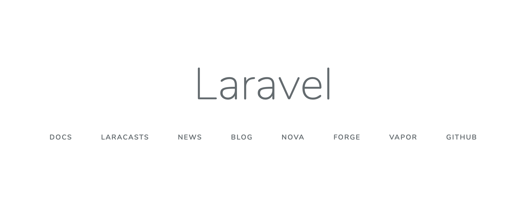

Laravel の開発環境を Docker を使って構築してみたのでその話です。

## なぜ Docker を使うのか

### 少ないソースコードで簡単に開発環境を構築し管理できる

まず、Docker ではコンテナという単位でサービス（MySQL や Nginx など）を動かしています。  
このコンテナというものは Docker イメージを元に作成できます。

Docker イメージには MySQL のイメージや Nginx のイメージなどが存在し、主要なイメージについてはすでに公式に用意され共有されています。  
つまり、Docker で開発環境を構築する際にはこれらの Docker イメージを元にコンテナを作成し、各コンテナを連携させてあげるだけで OK なのです。  
実際に触ってみるとわかると思いますが、かなり簡単にローカル開発環境を立ち上げることができます。

今回、Laravel 開発用に PHP+Nginx+MySQL の環境を作りましたが、それらの環境を定義しているファイルは 60 行程度の内容で済んでいます。  
コード量も少なく学習コストも少ないため、簡単に触りやすいというのはとても良いことだと思います。  
また、インフラの情報をコードで管理できるというのも Docker の利点ですね。

### コンテナごとデプロイすることで複数の環境で同じ環境を作ることができる

同じアプリケーションを開発してるのに開発メンバーの参入時期によって開発環境が違うということが、チームで開発する際に稀にあると思います。

ただ、開発環境の統一ということであれば、他の仮想環境構築ツール（Vagrant 等）でもある程度は実現可能です。  
Docker はさらに何がすごいかというと、コンテナごとデプロイ可能な点です。

AWS の ECS、GCP の GCE など Docker コンテナごとデプロイできるサービスがいくつかあるのですが、  
こういったサービスを活用すればローカル環境と本番環境で全く同じインフラ構成を使うことができてしまいます。

例えば、開発環境やステージング環境は Nginx なのに本番環境は Apache を使っていることが原因で、  
問題があった際に本番環境と同じ環境での検証が困難といったこともあると思います（経験談）。  
それらのチグハグな環境を Docker をコンテナごとデプロイすることで統一できます。

## Docker を使える環境を整える

Windows の場合は Docker Desktop for Windows をインストールできます。  
https://hub.docker.com/editions/community/docker-ce-desktop-windows

Mac の場合は以下の URL から Docker Desktop for Mac をインストールできます。  
https://hub.docker.com/editions/community/docker-ce-desktop-mac

なお、上記をダウンロードするためには DockerHub にメールアドレスを登録してログインする必要があります。

インストールしたら Docker クライアントを立ち上げておきましょう。  
Docker を使うための準備は以上で完了です。

## Docker 立ち上げ用のファイルを用意する

Laravel 用の Docker 環境として有名なものに[Laradock](https://laradock.io)というものがあります。  
Laradock はドキュメントが充実していて、さらに Symfony や WordPress など他の PHP を使った開発環境構築をサポートしているなど、なかなか便利ではあります。

ただ、Laradock は色々なプロジェクトをサポートしている影響でコード量が多くなり管理や設定がめんどうな側面がある上に、  
初回起動に時間が結構かかる（20 分くらい待った記憶があります）のがやや難点だと感じています。

そのため、Laradock は使わずに Laravel 専用のコンパクトな Docker 環境を用意して使おうと思います。  
Laravel を動かす最低限の環境として、以下の 3 つの Docker イメージを使い、3 つの Docker コンテナを作成します。

- [PHP 7.2 fpm](https://hub.docker.com/_/php)（PHP の実行環境）
- [MySQL 5.7](https://hub.docker.com/_/mysql)（DB サーバー）
- [Nginx](https://hub.docker.com/_/nginx)（Web サーバー）

また、今回用意する環境では Laravel を使うために PHP の実行コンテナの中に Composer や Node.js をインストールしていきます。  
（つまり、端末に直接 Composer 等のインストールをする必要はありません。Docker 便利ですよね）

なお、今回使用する Docker ファイルは[こちら](http://rabbitfoot141.hatenablog.com/entry/2018/08/16/222403)のページを参考にさせていただいて作成しました。

それでは、さっそく Laravel 用の Docker ファイルを Git からダウンロードしましょう。  
下記のコマンドを入力します。

```bash
$ git clone https://github.com/YopiNoji/docker-for-laravel.git
$ cd docker-for-laravel/
$ rm -rf .git
```

なお、今回はこのまま「docker-for-laravel」というプロジェクトフォルダに環境を構築しますが、作成するアプリによってプロジェクトフォルダの名前は適宜書き換えた方が良いと思います。

## Docker Compose を使い開発環境を立ち上げる

MySQL、Nginx、PHP の 3 つのコンテナを立ち上げます。

プロジェクトフォルダに入ったら、早速環境を立ち上げていきましょう。
環境の立ち上げには Docker Compose を用います。  
Docker Compose は複数のコンテナを使う Docker 環境を YML ファイルに定義することで、それらを連動して起動できるツールです。

docker-compose.yml に起動時の処理が定義してあるので、入力するコマンドはたったの 1 行だけです。

```bash
$ docker-compose up -d --build
```

上手くコンテナが立ち上げっていれば、以下のログが表示されるはずです。  
上から順番に MySQL コンテナ、PHP コンテナ、Nginx コンテナになります。

```bash
Successfully tagged docker-for-laravel_app:latest
Starting docker-for-laravel_db_1 ... done
Creating docker-for-laravel_app_1 ... done
Creating docker-for-laravel_web_1 ... done
```

ローカル環境のポートがすでに占有されている場合などは起動しないと思うので、適宜書き換えてください。

起動が完了したら、ちゃんと立ち上がっているのか念のために確認しておきましょう。  
以下のコマンドを実行して、3 つコンテナが存在していれば OK です。

```bash
$ docker ps
CONTAINER ID        IMAGE                    COMMAND                  CREATED             STATUS              PORTS                               NAMES
393ea9dec90e        nginx                    "nginx -g 'daemon of…"   4 minutes ago       Up 4 minutes        0.0.0.0:80->80/tcp                  docker-for-laravel_web_1
588739d27992        docker-for-laravel_app   "docker-php-entrypoi…"   4 minutes ago       Up 4 minutes        9000/tcp                            docker-for-laravel_app_1
0d652fa7d142        mysql:5.7                "docker-entrypoint.s…"   7 minutes ago       Up 4 minutes        0.0.0.0:3306->3306/tcp, 33060/tcp   docker-for-laravel_db_1
```

## Docker 環境に Laravel をインストールする

さて、ここまでですでに Laravel を動かすための環境はおおむね用意できました。  
ただし、肝心の Laravel プロジェクトはまだ存在していない状態なので早速インストールしましょう。

Docker を立ち上げる際に、PHP のパッケージ管理ツール Composer から laravel/installer をコンテナにインストールしておいたので、  
下記のコマンドを実行するだけで Laravel を用意できます。

```bash
$ docker-compose exec app laravel new
```

インストール完了後に Web ブラウザから localhost にアクセスすると Laravel の初期ページが表示されているはずです。



## MySQL に Laravel 用の DB を作る

次に MySQL に DB を作成します。  
MySQL コンテナに入るため、以下を入力します。

```bash
$ docker-compose exec db mysql -uroot -ppassword
```

MySQL コンテナに入れたら以下を入力して DB を作成します。

```bash
mysql> create database laravel default character set utf8;
```

DB が作成できたら、Laravel の環境変数を設定してあげて、Laravel から DB にアクセスできるようにしてあげます。
.env にある環境変数の以下の部分を書き換えてあげます。

```
DB_CONNECTION=mysql
DB_HOST=db
DB_PORT=3306
DB_DATABASE=laravel
DB_USERNAME=root
DB_PASSWORD=password
```

これで DB のセットアップは完了です。

## 試しに DB にマイグレーションしてみる

DB のセットアップが完了したので、試しに Laravel の DB にテーブルを作ってみましょう。  
今回は Laravel セットアップ時ににデフォルトで作成されるマイグレーションファイルを元にしてテーブルを作ってみます。

ひとまず、Laravel が配置してあるコンテナにアクセスします。  
以下のコマンドでアクセスできるはずです。

```bash
$ docker-compose exec app bash
```

Laravel のアプリケーションコンテナにアクセスできたら、マイグレーション実行コマンド（php artisan migrate）を入力してみます。

```bash
root@588739d27992:/var/www/html# php artisan migrate
Migration table created successfully.
Migrating: 2014_10_12_000000_create_users_table
Migrated:  2014_10_12_000000_create_users_table (0.05 seconds)
Migrating: 2014_10_12_100000_create_password_resets_table
Migrated:  2014_10_12_100000_create_password_resets_table (0.02 seconds)
Migrating: 2019_08_19_000000_create_failed_jobs_table
Migrated:  2019_08_19_000000_create_failed_jobs_table (0.01 seconds)
```

DB 接続に問題なければ上記の表示になるはずです。

ここまで動くことを確認できれば、あとは好きなように Laravel を弄って開発していくだけです。  
割と簡単に Laravel 開発環境を構築できたのではないでしょうか。

## 参考

[「それコンテナにする意味あんの？」迷える子羊に捧げるコンテナ環境徹底比較](https://dev.classmethod.jp/cloud/aws/cmdevio2019-container/)

[docker-compose による nginx + HTTP/2 + PHP-FPM7 + MySQL 環境の構築方法](https://tech.recruit-mp.co.jp/infrastructure/post-12795/)

[Laravel の動く環境を docker-compose(PHP 7.2 + nginx + MySQL)でいい感じにする](http://rabbitfoot141.hatenablog.com/entry/2018/08/16/222403)
