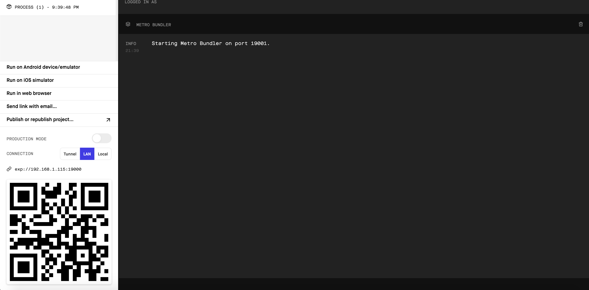

Expo CLI を使って React Native で開発を始めるにあたってのメモ書きです。

## Expo とは

まず、Expo とは何かについてですが、簡単にいうと以下のことが実現可能なツールです。

- React Native でのアプリ制作を支援するためのツール
- [React Native の公式チュートリアル](https://reactnative.dev/docs/getting-started)にも記載があるぐらいにはオフィシャルなツール
- QR コードを専用アプリで読み取ることで、ビルド不要で実機を使ってデバッグできる
- Apple の審査を通すことなくアプリの更新が可能（いわゆる Over The Air アップデート）

といった具合に便利なツールです。

ただ、便利な分で色々と制約があるのですが、とりあえずサクッとプロトタイプを作る用途には向いています。

## Expo CLI による React Native のはじめ方

開発を始めるにあたって、Node.js が必要になります。  
Node.js が使えることを確認しておきましょう。

```bash
node -v
v12.16.1
```

Expo CLI で React Native を始める際には、Expo CLI を npm でグローバルインストールする方法が一般的かと思います。  
よく書かれているのは以下のコマンドですね。

```bash
npm install expo-cli --global
```

ただ、個人的に npm でパッケージをグローバルにインストールするのが好きではないので、今回は使わない方法で行きます。

具体的には、npm のバージョン 5.2.0 以降に導入された npx を活用します。  
現在、node 使っている人にはだいたいインストールされているはずです。

npx ではコマンドが完了すると、使ったパッケージは削除されるので、環境を汚染する心配はありません。  
npx についてさらに知りたい場合は、以下を参照してください。

https://qiita.com/tonkotsuboy_com/items/8227f5993769c3df533d

とにかく、npx で Expo CLI を使い、React Native を始める場合は以下のコマンドを入力します。

```bash
npx expo-cli init
```

入力すると、以下のように作成するプロジェクトの情報を選ぶ CUI が出てくるので、コマンド操作で選びます。

```bash
? Choose a template:
  ----- Managed workflow -----
  blank                 a minimal app as clean as an empty canvas
❯ blank (TypeScript)    same as blank but with TypeScript configuration
  tabs                  several example screens and tabs using react-navigation
  ----- Bare workflow -----
  minimal               bare and minimal, just the essentials to get you started

  minimal (TypeScript)  same as minimal but with TypeScript configuration

? What is the name of your project? todo-app-by-react-native-with-expo
```

今回は、`todo-app-by-react-native-with-expo` という名前でプロジェクトを作成しています。

インストールが終わると、以下のような表示になると思います。
Expo CLI がインストールされていないので、`undefined` と表示されてしまっています。

```bash
To get started, you can type:

  cd todo-app-by-react-native-with-expo
  undefined start
```

Expo CLI がインストールされていない状態だと、React Native の開発環境を立ち上げることはできません。  
なので、グローバルにはインストールしませんが、ローカル環境に Expo CLI をインストールします。

具体的には、以下のコマンドを入力します。

```bash
cd todo-app-by-react-native-with-expo
npm i --save-dev expo-cli
```

これで、Expo CLI がローカル環境で使えるようになりました。

`package.json` は以下のように状態になるはずです。

```json
{
  "main": "node_modules/expo/AppEntry.js",
  "scripts": {
    "start": "expo start",
    "android": "expo start --android",
    "ios": "expo start --ios",
    "web": "expo start --web",
    "eject": "expo eject"
  },
  "dependencies": {
    "expo": "~36.0.0",
    "react": "~16.9.0",
    "react-dom": "~16.9.0",
    "react-native": "https://github.com/expo/react-native/archive/sdk-36.0.0.tar.gz",
    "react-native-screens": "2.0.0-alpha.12",
    "react-native-web": "~0.11.7"
  },
  "devDependencies": {
    "@babel/core": "^7.0.0",
    "@types/react": "~16.9.0",
    "@types/react-native": "~0.60.23",
    "babel-preset-expo": "~8.0.0",
    "expo-cli": "^3.13.8",
    "typescript": "~3.6.3"
  },
  "private": true
}
```

Expo CLI がローカルで使えるようになったら、開発環境を立ち上げてみます。

`package.json` の `scripts`　に開発環境立ち上げのコマンドが色々と書かれています。  
ひとまず、以下のコマンドを入力します。

```bash
npm start
```



上記の画面が出てくれば、環境構築は完了です。

## 実際にスマートフォンから作ったアプリを確認してみる

Expo を使った開発では、[Expo Client](https://apps.apple.com/jp/app/expo-client/id982107779) というアプリを用いることで、実機を使いデバッグしながら開発を行うことができます。

ひとまず、スマホに [Expo Client](https://apps.apple.com/jp/app/expo-client/id982107779) をインストールして、サインアップまで済ませておきましょう。

[Expo Client](https://apps.apple.com/jp/app/expo-client/id982107779) のインストールを済ませたら、スマホのカメラで先ほどのブラウザ画面に表示されていた QR コードを読み取ってみましょう。


読み取る際のイメージは、iPhone の場合だと上記のような感じです。  
純正のカメラアプリで読み取ると、「Expo で開く」という表示が出るので、それを押下します。

[Expo Client](https://apps.apple.com/jp/app/expo-client/id982107779) アプリで開いた際に、作成したアプリが表示されれば完了です。

## 最後に

あとは、ここら辺のチュートリアルを読みながらコードを書きましょう。

https://docs.expo.io/versions/latest/tutorial/planning/

ちなみにこの投稿に続けて、React Native で Todo リストを作成するチュートリアルを書こうかなと思っています。
