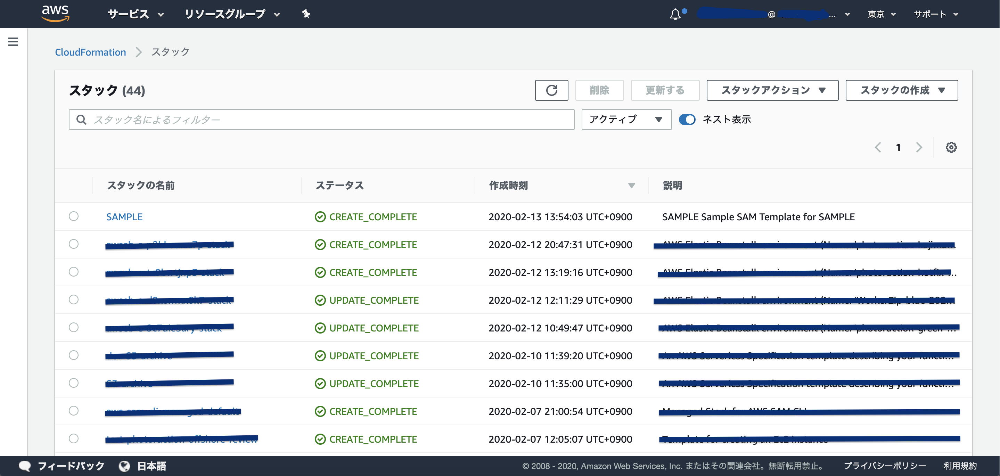
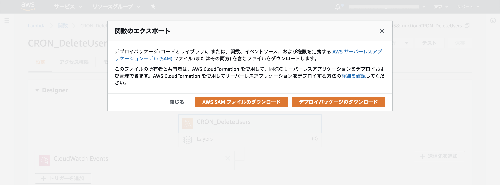

サーバーレスアーキテクチャの実現など何かと便利な AWS Lambda ですが、Git 管理など考えだすと色々と悩むことも多いかと思います。  
そんな中で、[AWS サーバーレスアプリケーションモデル (SAM)](https://aws.amazon.com/jp/serverless/sam/) という神 OSS を試してみたので、それについての記事です。

## SAM とは何か

SAM を使ってみた感想を簡単にいうと以下のような感じです。

- Lambda の Git 管理が可能になる
- yml ファイルにサーバーレスアプリで使う以下の情報を定義しておくことが可能
  - DynamoDB のキー構成
  - Lambda のメモリサイズやタイムアウト時間
  - API Gateway の構成
  - 他多数
- yml ファイルに書いた定義のサーバーレスアプリ（Lambda/DynamoDB/APIGateway など）をコマンド数行で AWS にデプロイできる
- ローカル環境でサーバーレスアプリのデバッグが可能

控えめに言って神だと思います。

さらに詳細な情報は、[こちら](https://aws.amazon.com/jp/serverless/sam/)を参照してください。

OSS なので、[ソースコード](https://github.com/awslabs/serverless-application-model)が公開されています。  
言語は AWS-CLI と同じく、Python で書かれているみたいです。
コントリビュータも募集しているみたいなので興味があれば是非。

## 必要なもの

さて、簡単に使い方を解説しようと思うのですが、以下が必要になるのであらかじめ用意しておいてください。

- AWS アカウント
- AWS についての基礎知識
- IAM の認証情報（アクセスキー）
- Docker

## Docker で SAM を使う環境を構築する

さて、今回 SAM を使うにあたって、SAM の環境は全て Docker 化してしまいたいと思います。

```Dockerfile
FROM python:latest

WORKDIR /usr/src
RUN pip install awscli
RUN pip install --user --upgrade aws-sam-cli
ENV PATH $PATH:/root/.local/bin

CMD ["/bin/sh"]
```

Dockerfile は上記を用います。  
Python のイメージを使いつつ、必要なパッケージをインストールする構成ですね。

```yml
version: "3"
services:
  app:
    build:
      context: .
      dockerfile: Dockerfile
    container_name: AWS
    tty: true
    volumes:
      - .:/usr/src
```

docker-compose.yml は上記を用います。  
特筆することもない Dockerfile を起動するためだけの構成です。

Dockerfile と docker-compose.yml のサンプルは、自分の Git リポジトリにも置いてあるので、分からなくなったら[こちら](https://github.com/YopiNoji/docker-for-aws-sam)を参照してください。

Docker コンテナを立ち上げる準備ができたら、早速立ち上げます。

```bash
docker-compose up -d --build
```

コンテナが立ち上がっていたら OK です。

```bash
docker ps
```

## AWS の認証情報を設定する

さて、コンテナが立ち上がったらコンテナの内部で SAM を使う設定を済ませちゃいましょう。

まず、コンテナ内部に `bash` で入ります。

```bash
docker-compose exec app bash
```

コンテナ内部に入ったら、AWS-CLI で認証情報を登録します。

```bash
aws configure
```

以下はサンプルです。
IAM から作成したアクセスキーの情報を設定してください。

```bash
AWS Access Key ID [None]: ****************ID
AWS Secret Access Key [None]: ***************Key
Default region name [None]: ap-northeast-1
Default output format [None]: json
```

アクセスキーを設定する際に、**アクセスキーの IAM ユーザーが S3/CloudFormation/IAM にアクセス権限があることは確認しておいた方が良い**と思います。

SAM は、CloudFormation を用いて S3 に配置したファイルから Lambda のファンクションを生成する都合で、CloudFormation や S3 へのアクセス権限が必要になります。  
権限がない場合、全く関係なさそうなエラーが出て、少し詰まるかもしれないです。（自分は少し詰まりました）

認証情報の設定ができたら、問題なく AWS-CLI が使えることを確認しておきます。

以下のコマンドで S3 のバケットを一覧表示することで、認証情報に問題がないことを確かめます。

```bash
aws s3 ls
```

## SAM でサンプルプロジェクトを作る

はい、お待たせしました。  
ようやく SAM を触れます。

試しに SAMPLE という名前のプロジェクトを作ってみます。

```bash
sam init --name SAMPLE
```

CUI から作成するプロジェクトのテンプレートを選ぶことができます。  
今回は、Python で "Hello World" するテンプレートを選んでみます。

```bash
Which template source would you like to use?
        1 - AWS Quick Start Templates
        2 - Custom Template Location
Choice: 1

Which runtime would you like to use?
        1 - nodejs12.x
        2 - python3.8
        3 - ruby2.5
        4 - go1.x
        5 - java11
        6 - dotnetcore2.1
        7 - nodejs10.x
        8 - python3.7
        9 - python3.6
        10 - python2.7
        11 - java8
        12 - dotnetcore2.0
        13 - dotnetcore1.0
Runtime: 2

Cloning app templates from https://github.com/awslabs/aws-sam-cli-app-templates.git

AWS quick start application templates:
        1 - Hello World Example
        2 - EventBridge Hello World
        3 - EventBridge App from scratch (100+ Event Schemas)
Template selection: 1

-----------------------
Generating application:
-----------------------
Name: SAMPLE
Runtime: python3.8
Dependency Manager: pip
Application Template: hello-world
Output Directory: .

Next steps can be found in the README file at ./SAMPLE/README.md
```

SAMPLE プロジェクトの配下は以下のような構成になっているかと思います。

```
/usr/src/SAMPLE
|--.gitignore
|--README.md
|--events
|  |--event.json
|--hello_world
|  |--__init__.py
|  |--app.py
|  |--requirements.txt
|--template.yaml
|--tests
|  |--unit
|  |  |--__init__.py
|  |  |--test_handler.py
```

この中で核となるのは **template.yaml** です！  
**template.yaml** に書かれた情報を元に SAM は AWS でサーバーレスアプリを構築してくれます。

Lambda だけでなく、DynamoDB や S3 など Lambda と連携させる AWS のサービスを **template.yaml** に記述することで好きなようにサーバーレスアプリを構築するというわけです。

**template.yaml** の記述方法については、以下に詳しい情報が載っているので、そちらを参照してください。

https://github.com/awslabs/serverless-application-model/blob/master/versions/2016-10-31.md#event-source-types

## SAM でサンプルプロジェクトを AWS にデプロイする

さて、それでは早速作った Hellow World プロジェクトを AWS にデプロイしてみましょう。

プロジェクト配下に移動して、`sam build` とビルドコマンドを入力します。

```bash
cd SAMPLE
sam build
```

ビルドが上手くいけば、以下のような表示になるはずです。

```bash
Building resource 'HelloWorldFunction'
Running PythonPipBuilder:ResolveDependencies
Running PythonPipBuilder:CopySource

Build Succeeded

Built Artifacts  : .aws-sam/build
Built Template   : .aws-sam/build/template.yaml

Commands you can use next
=========================
[*] Invoke Function: sam local invoke
[*] Deploy: sam deploy --guided
```

もし、ビルドが上手くいかない場合は、`sam validate` というコマンドでバリデーションを実行することもできるので試してみてください。

ビルドが成功すると、`.aws-sam/build` というフォルダが生成され、SAM はそのフォルダの内容をデプロイしてくれます。

さて、それでは次はいよいよデプロイです。  
以下のコマンドを入力します。

```bash
sam deploy --guided
```

デプロイコマンドを入力すると、デプロイに関する設定項目が CUI 上に出てきます。

```bash

Configuring SAM deploy
======================

        Looking for samconfig.toml :  Not found

        Setting default arguments for 'sam deploy'
        =========================================
        Stack Name [sam-app]: SAMPLE
        AWS Region [us-east-1]: ap-northeast-1
        #Shows you resources changes to be deployed and require a 'Y' to initiate deploy
        Confirm changes before deploy [y/N]: Y
        #SAM needs permission to be able to create roles to connect to the resources in your template
        Allow SAM CLI IAM role creation [Y/n]: Y
        Save arguments to samconfig.toml [Y/n]: Y

        Looking for resources needed for deployment: Found!

                Managed S3 bucket: aws-sam-cli-managed-default-samclisourcebucket-6pznpzymjkh1
                A different default S3 bucket can be set in samconfig.toml

        Saved arguments to config file
        Running 'sam deploy' for future deployments will use the parameters saved above.
        The above parameters can be changed by modifying samconfig.toml
        Learn more about samconfig.toml syntax at
        https://docs.aws.amazon.com/serverless-application-model/latest/developerguide/serverless-sam-cli-config.html

        Deploying with following values
        ===============================
        Stack name                 : SAMPLE
        Region                     : ap-northeast-1
        Confirm changeset          : True
        Deployment s3 bucket       : aws-sam-cli-managed-default-samclisourcebucket-6pznpzymjkh1
        Capabilities               : ["CAPABILITY_IAM"]
        Parameter overrides        : {}

```

- Stack Name: Cloud Formation 上に表示されるスタック名
- AWS Region: AWS リージョン
- Confirm changes before deploy: デプロイ前に変更を確認するか
- Allow SAM CLI IAM role creation: SAM が IAM ロール作ることを許可するか
- Save arguments to samconfig.toml: デプロイ設定を samconfig.toml に保存するか

自分の環境に合わせて解答します。

```bash

Initiating deployment
=====================
Uploading to SAMPLE/629011accc9661b78a3654707be1979f  532311 / 532311.0  (100.00%)
Uploading to SAMPLE/3442a3fa19433af53effe5744ad98b65.template  1086 / 1086.0  (100.00%)

Waiting for changeset to be created..

CloudFormation stack changeset
------------------------------------------------------------------------------------------------------
Operation                          LogicalResourceId                  ResourceType
------------------------------------------------------------------------------------------------------
+ Add                              HelloWorldFunctionHelloWorldPerm   AWS::Lambda::Permission
                                   issionProd
+ Add                              HelloWorldFunctionRole             AWS::IAM::Role
+ Add                              HelloWorldFunction                 AWS::Lambda::Function
+ Add                              ServerlessRestApiDeployment47fc2   AWS::ApiGateway::Deployment
                                   d5f9d
+ Add                              ServerlessRestApiProdStage         AWS::ApiGateway::Stage
+ Add                              ServerlessRestApi                  AWS::ApiGateway::RestApi
------------------------------------------------------------------------------------------------------

Changeset created successfully. arn:aws:cloudformation:ap-northeast-1:123451234512:changeSet/samcli-deploy1581566154/0e18d903-3d5c-474e-9285-f8be55bd31ed


Previewing CloudFormation changeset before deployment
======================================================
Deploy this changeset? [y/N]:
```

デプロイの準備が完了すると、変更箇所を表示しデプロイを実行するのか聞いてきます。  
問題なければ、`Y`を入力します。

```bash
2020-02-13 04:54:12 - Waiting for stack create/update to complete

CloudFormation events from changeset
-----------------------------------------------------------------------------------------------------
ResourceStatus            ResourceType              LogicalResourceId         ResourceStatusReason
-----------------------------------------------------------------------------------------------------
CREATE_IN_PROGRESS        AWS::IAM::Role            HelloWorldFunctionRole    -
CREATE_IN_PROGRESS        AWS::IAM::Role            HelloWorldFunctionRole    Resource creation
                                                                              Initiated
CREATE_COMPLETE           AWS::IAM::Role            HelloWorldFunctionRole    -
CREATE_IN_PROGRESS        AWS::Lambda::Function     HelloWorldFunction        -
CREATE_IN_PROGRESS        AWS::Lambda::Function     HelloWorldFunction        Resource creation
                                                                              Initiated
CREATE_COMPLETE           AWS::Lambda::Function     HelloWorldFunction        -
CREATE_IN_PROGRESS        AWS::ApiGateway::RestAp   ServerlessRestApi         Resource creation
                          i                                                   Initiated
CREATE_IN_PROGRESS        AWS::ApiGateway::RestAp   ServerlessRestApi         -
                          i
CREATE_COMPLETE           AWS::ApiGateway::RestAp   ServerlessRestApi         -
                          i
CREATE_IN_PROGRESS        AWS::ApiGateway::Deploy   ServerlessRestApiDeploy   -
                          ment                      ment47fc2d5f9d
CREATE_IN_PROGRESS        AWS::Lambda::Permission   HelloWorldFunctionHello   -
                                                    WorldPermissionProd
CREATE_IN_PROGRESS        AWS::Lambda::Permission   HelloWorldFunctionHello   Resource creation
                                                    WorldPermissionProd       Initiated
CREATE_COMPLETE           AWS::ApiGateway::Deploy   ServerlessRestApiDeploy   -
                          ment                      ment47fc2d5f9d
CREATE_IN_PROGRESS        AWS::ApiGateway::Deploy   ServerlessRestApiDeploy   Resource creation
                          ment                      ment47fc2d5f9d            Initiated
CREATE_IN_PROGRESS        AWS::ApiGateway::Stage    ServerlessRestApiProdSt   -
                                                    age
CREATE_IN_PROGRESS        AWS::ApiGateway::Stage    ServerlessRestApiProdSt   Resource creation
                                                    age                       Initiated
CREATE_COMPLETE           AWS::ApiGateway::Stage    ServerlessRestApiProdSt   -
                                                    age
CREATE_COMPLETE           AWS::Lambda::Permission   HelloWorldFunctionHello   -
                                                    WorldPermissionProd
CREATE_COMPLETE           AWS::CloudFormation::St   SAMPLE                    -
                          ack
-----------------------------------------------------------------------------------------------------

Stack SAMPLE outputs:
-----------------------------------------------------------------------------------------------------
OutputKey-Description                              OutputValue
-----------------------------------------------------------------------------------------------------
HelloWorldFunctionIamRole - Implicit IAM Role      arn:aws:iam::123451234512:role/SAMPLE-
created for Hello World function                   HelloWorldFunctionRole-D7WTP3555NM3
HelloWorldApi - API Gateway endpoint URL for       https://syyzchdkxg.execute-api.ap-
Prod stage for Hello World function                northeast-1.amazonaws.com/Prod/hello/
HelloWorldFunction - Hello World Lambda Function   arn:aws:lambda:ap-
ARN                                                northeast-1:123451234512:function:SAMPLE-
                                                   HelloWorldFunction-ICQ6V41BKCJK
-----------------------------------------------------------------------------------------------------

Successfully created/updated stack - SAMPLE in ap-northeast-1

```

デプロイが上手くいくと、上記のように何が反映されたのかを表示してくれます。



AWS の CloudFormation をみると SAMPLE プロジェクトのデプロイが上手く行ったと分かります。

## すでに存在する Lambda を SAM で扱う

すでに AWS Lambda に存在する関数を SAM 環境に持っていくことも可能です。  
ただ、SAM で使う場合、既存の上書きというよりコピーした関数の新規作成といった感じになるので、そこは留意してください。



Lambda のメニューから「関数のエクスポート」を選ぶと、「AWS SAM ファイルのダウンロード」と「デプロイパッケージのダウンロード」という項目があるので、どちらもダウンロードします。  
ダウンロードしたファイルは、簡単にいうと以下になります。

- AWS SAM ファイル： template.yaml の元となる yml ファイル
- デプロイパッケージ： 関数のソースファイル（Zip 圧縮）

Zip 化されたソースコードは解凍しておきます。

次に、先ほどと同じように、SAM でプロジェクトを作成します。

```bash
sam init --name PROJECT
```

作成したプロジェクトの template.yaml はダウンロードした AWS SAM ファイルの内容で上書きします。

この際に気をつけなければならないのは、**ダウンロードした AWS SAM ファイルの内容をコピーしただけだと関数の名前など一部の項目が設定されていないため、そのままデプロイすると Lambda の関数名や DynamoDB のテーブル名がランダム文字列になってしまう**という点です。

以下の例のように、template.yaml に対して `FunctionName` や `TableName` を追記しておきます。

```yml
AWSTemplateFormatVersion: "2010-09-09"
Transform: "AWS::Serverless-2016-10-31"
Description: An AWS Serverless Specification template describing your function.
Resources:
  Lambda:
    Type: "AWS::Serverless::Function"
    Properties:
      FunctionName: S3_zip
      Handler: lambda_function.lambda_handler
      Runtime: python3.8
      CodeUri: function/
      Description: ""
      MemorySize: 3008
      Timeout: 300
      Role: "arn:aws:iam::123451234512:role/service-role/Lambda_S3_Zip"
      Events:
        DynamoDB1:
          Type: DynamoDB
          Properties:
            Stream:
              "Fn::GetAtt":
                - DynamoDB
                - StreamArn
            StartingPosition: TRIM_HORIZON
            BatchSize: 100
  DynamoDB:
    Type: "AWS::DynamoDB::Table"
    Properties:
      TableName: S3_zip
      AttributeDefinitions:
        - AttributeName: id
          AttributeType: S
        - AttributeName: sort
          AttributeType: N
      KeySchema:
        - AttributeName: id
          KeyType: HASH
        - AttributeName: sort
          KeyType: RANGE
      ProvisionedThroughput:
        ReadCapacityUnits: 5
        WriteCapacityUnits: 5
      StreamSpecification:
        StreamViewType: NEW_IMAGE
```

英語資料のみですが、以下から template.yaml の書き方などを調べることができます。

https://docs.aws.amazon.com/serverless-application-model/index.html

最後に、`CodeUri` に記載してあるパスに、Zip でダウンロードしてきたソースコードを展開しておく必要があります。

あとは、先ほどと同じように、`sam build` でデプロイするアプリをビルドし、`sam deploy --guided` で AWS にデプロイするだけです。

## 最後に

今回、SAM を使って Lambda を使ったサーバーレスアプリの作成を試してみたのですが、  
まだまだ試せていない機能（関数のローカル実行など）も多く、今後の拡張にも期待できる良い OSS だと思います。  
AWS でサーバーレスアーキテクチャを試すなら、是非とも試してみてほしいです。
