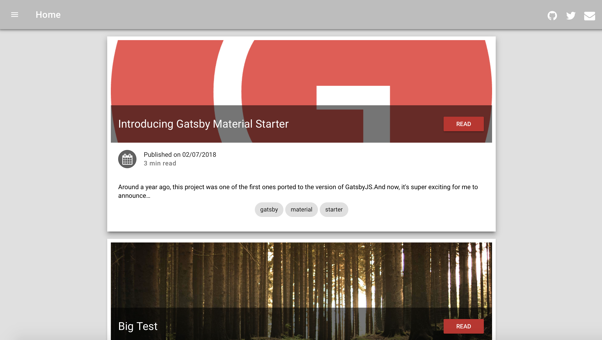

Gatsby を使ったブログのはじめ方についての解説記事です。  
ブログを例にしていますが、コーポレートサイトなど他のサイト制作にも活用できると思います。

ちなみに、Gatsby 公式の手順では Gatsby CLI という CLI ツールをインストールして環境構築する方法が載っていますが、  
今回は CLI ツールをインストールしない方法での環境構築手順になります。

## 開発環境準備

Gatsby は [Node.js](https://nodejs.org/ja/) が使える環境で動きます。  
インストールしていない場合は、PC に [Node.js](https://nodejs.org/ja/) をインストールしておきましょう。

Node.js を PC にインストールしたくない場合、[DockerでNode.jsが使える仮想環境を準備する方法](docker-for-gatsby-js)もあるので、興味があればそちらも参照してみてください。

インストールが済んだら、Node.js 本体とそのパッケージ管理ツール npm が使えることを確認しましょう。  
npm は Node.js インストール時にインストールされます。

インストールを確認するには、CUI にバージョンを確認するコマンドを入力してみます。  
バージョン情報が出ていれば正常にインストールされています。

```bash
node -v
v10.16.0

npm -v
6.9.0
```

環境構築前に用意する必要があるものは以上です。

ちなみに、Gatsby 公式の手順では Gatsby CLI という CLI ツールをインストールして環境構築する方法が載っていますが、  
今回は CLI ツールをインストールしない方法での環境構築手順になります。

## Gatsby プロジェクトの作成

まず、Gatsby でウェブサイトを作る際のスターターを選択しましょう。  
スターターは Gatsby でウェブサイトを作る際の雛形やテンプレートのようなもので、開発者やユーザーがスターターを用意してくれています。

- [Gatsby Starters](https://www.gatsbyjs.org/starters/?v=2)

執筆時点で 260 種類以上あるのでどれを選ぶか迷うかもしれません。

[Gatsby の作者が作ったスターター](https://www.gatsbyjs.org/starters/gatsbyjs/gatsby-starter-default/)や [Netlify 社が用意しているスターター](https://www.gatsbyjs.org/starters/netlify-templates/gatsby-starter-netlify-cms/)などが人気のようですが、  
個人的にはコードの可読性があまり良くないと感じたためこちらは使っていません。

個人的に[gatsby-material-starter](https://www.gatsbyjs.org/starters/Vagr9K/gatsby-material-starter/)や[gatsby-advanced-starter](https://www.gatsbyjs.org/starters/Vagr9K/gatsby-advanced-starter/)がコードの可読性が良くて好みです。

スターターを決めたら、Gatsby のプロジェクトファイルを用意しましょう。  
CUI でプロジェクトを作成するフォルダに移動し、以下のコマンドを入力します。  
今回の例では[gatsby-material-starter](https://www.gatsbyjs.org/starters/Vagr9K/gatsby-material-starter/)を使用しています。

```bash
npx gatsby new gatsby-site https://github.com/Vagr9K/gatsby-material-starter
```

コマンドを実行すると、実行したフォルダ直下に gatsby-site というフォルダができているはずです。  
そのフォルダが Gatsby のプロジェクトファイルになります。

ちなみに、今回使用した [gatsby-material-starter](https://www.gatsbyjs.org/starters/Vagr9K/gatsby-material-starter/) では、以下がデフォルトで含まれています。

- Markdown ファイルでの投稿データ作成機能
- タグやカテゴリーによる投稿の分類機能
- CSS Module による CSS 記述
- JSX による記述

## Gatsbyの開発環境を立ち上げる

Gatsby のプロジェクトファイルを作成したら、ローカル環境で Gatsby を動作させてみましょう。  
ひとまず、CUI から作成したフォルダに移動します。

```bash
cd gatsby-site
```

プロジェクトファイル（gatsby-site）に移動したら、開発環境を立ち上げます。  
以下のコマンドを入力します。

```bash
npm run develop
```

コマンド入力したことで、CUI に色々とステータスが表示されますが、  
一通り収まった後に、[localhost:8000](http://localhost:8000)にアクセスしてみます。  
Gatsby のスターターで作られたサイトが表示されていれば、開発環境の構築は完了です。



ちなみに、静的サイトを生成したい場合は、以下のコマンドの入力します。

```bash
npm run build
```

public フォルダに Gatsby により静的サイトが生成されます。

## フォルダ構成の解説

ここからは、簡単に Gatsby プロジェクトのフォルダ構成を解説していきます。  
ただ、使用するスターターによってフォルダ構成は異なるので参考程度に考えてもらえればと思います。  
今回は[gatsby-material-starter](https://www.gatsbyjs.org/starters/Vagr9K/gatsby-material-starter/)でのフォルダ構成を例に解説していきます。


### gatsby-config.js
プラグインの情報やサイト全体で使う情報などを記述するファイルです。  
プラグインを追加する際には編集する必要が出てきます。

### gatsby-node.js
投稿データを GraphQL で取得しページとして生成する際の情報などを記述するファイルです。  
投稿データによりページ生成する際の動作をカスタマイズする場合に編集します。

### content
Markdown ファイルで書かれた投稿データを配置する場所です。  
初期状態ではサンプル記事がいくつか存在するので、ここを書き直せば個人ブログになりますね。

### src/components
再利用可能なコンポーネントファイルを配置する場所です。

### src/pages
固定の URL を持つページを作る際のファイルを配置する場所です。  
WordPress でいうところの固定ページを作る際に弄ります。  
ここにあるファイルを使ってルーティングも行ってくれます。

### src/templates
投稿ページなどの固定の URL ではないページを生成するためのファイルを配置する場所です。

### src/layout
サイト全体での共通のレイアウトを配置する場所です。  
レイアウトを複数作ることで、ページによりレイアウトを切り替えることも可能です。

## 終わりに

あとは自分好みにソースコードを改修してサイトを作っていくだけです。

Gatsby はホットリロード対応なので、  
ソースを修正して保存するとその内容がすぐにローカル開発環境へ反映されて確認できます。

Gatsby で作成したサイトを Web 上で公開する方法については、別記事で解説しているので、  
公開する際にはそちらも参考にしてみてください。

## 参考

[Gatsby ドキュメント](https://www.gatsbyjs.org/docs/)