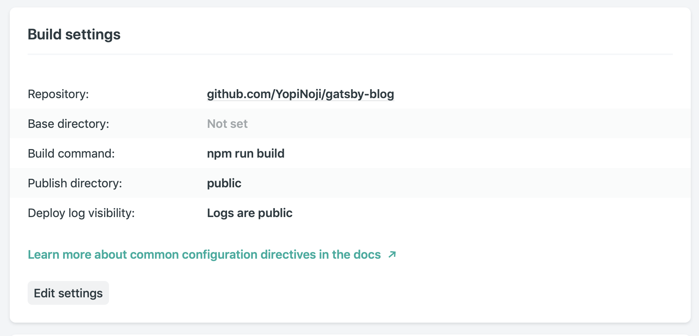

Netlify は本当に便利なサービスで、Git リポジトリが更新されるたびに、  
最新の状態にサイトを自動でビルド＆デプロイしてくれます。  
控えめに言って、神サービスだと思います。

ただ、設定はちゃんと行っているのに、Netlify でビルドエラーが起こることもあると思います。  
（というか自分はビルドエラーに悩まされました）

そういう訳で、自分の Gatsby を使ったサイトで Netlify のビルドに失敗した際の解決策を以下に記述していきます。

## 前提



前提として、Netlify 側の設定は上記のようになっています。  
紐付く Git リポジトリに更新がかかるたびに、`npm run build`して public フォルダに静的サイトを生成してくれる設定です。

## すでに存在する netlify.toml にコマンドを上書きされているパターン

自分が最初に直面したのは、以下のエラーです。

```
6:40:04 PM: Error running command: Build script returned non-zero exit code: 127
6:40:04 PM: Failing build: Failed to build site
6:40:04 PM: failed during stage 'building site': Build script returned non-zero exit code: 127
6:40:04 PM: Finished processing build request in 1m52.780127598s
```

netlify.toml 側で Build script returned non-zero exit code: 127 となるパターンです。  
調べていくと上記のエラーの場合は、ビルド時のコマンドに誤りがあるケースが多いようです。

ただ今回、自分の場合はビルドコマンドに `npm run build` を設定してあり、  
ローカルでは同コマンドで問題なくビルドされていました。

結局、原因は何だったのかというと netlify.toml でした。  
netlify.toml は Netlify でのビルド時にカスタム設定を使う際に必要になるファイルです。  
そして、netlify.toml にビルド時のコマンドとして `yarn build` と記載してあったのが原因でした。  
どうやら netlify.toml が存在する場合、Web からビルドコマンドを設定していても netlify.toml の設定が優先されてしまうようです。

そもそも、なぜこうなったのかというと、  
プロジェクト作成時に Gatsby のスターターを利用したのですが、  
自分が使用したスターターにすでに netlify.toml が存在していたことが原因でした。

何とも不覚です。

##大文字と小文字を間違えているパターン

netlify.toml の問題を解決したので、ようやく正常にビルドできる。  
そう思ったのもつかの間、新たなエラーが発生したのでした。

```
10:17:58 PM: Executing user command: npm run build
10:17:59 PM: > gatsby-starter-advanced@1.1.0 build /opt/build/repo
10:17:59 PM: > gatsby build
10:18:04 PM: success open and validate gatsby-configs — 0.014 s
10:18:05 PM: success load plugins — 1.143 s
10:18:05 PM: success onPreInit — 0.006 s
10:18:05 PM: success delete html and css files from previous builds — 0.006 s
10:18:05 PM: success initialize cache — 0.007 s
10:18:05 PM: success copy gatsby files — 0.022 s
10:18:05 PM: success onPreBootstrap — 0.014 s
10:18:05 PM: success source and transform nodes — 0.146 s
10:18:05 PM: success building schema — 0.343 s
10:18:05 PM: success createPages — 0.056 s
10:18:05 PM: success createPagesStatefully — 0.021 s
10:18:05 PM: success onPreExtractQueries — 0.002 s
10:18:05 PM: success update schema — 0.042 s
10:18:05 PM: success extract queries from components — 0.139 s
10:18:06 PM: success run static queries — 0.461 s — 2/2 4.34 queries/second
10:18:06 PM: success run page queries — 0.341 s — 7/7 20.60 queries/second
10:18:06 PM: success write out page data — 0.004 s
10:18:06 PM: success write out redirect data — 0.028 s
10:18:07 PM: success Build manifest and related icons — 0.000 s
10:18:07 PM: success onPostBootstrap — 0.003 s
10:18:07 PM: info bootstrap finished - 7.800 s
10:18:22 PM: failed during stage 'building site': Build script returned non-zero exit code: 1
10:18:22 PM: error Generating JavaScript bundles failed
10:18:22 PM:
10:18:22 PM:   Error: ./src/components/PostListing/PostListing.jsx
10:18:22 PM:   Module not found: Error: Can't resolve './Postlisting.css' in '/opt/build/repo  /src/components/PostListing'
10:18:22 PM:   resolve './Postlisting.css' in '/opt/build/repo/src/components/PostListing'
10:18:22 PM:     using description file: /opt/build/repo/package.json (relative path: ./src/c  omponents/PostListing)
10:18:22 PM:       Field 'browser' doesn't contain a valid alias configuration
10:18:22 PM:       using description file: /opt/build/repo/package.json (relative path: ./src  /components/PostListing/Postlisting.css)
10:18:22 PM:         no extension
10:18:22 PM:           Field 'browser' doesn't contain a valid alias configuration
10:18:22 PM:           /opt/build/repo/src/components/PostListing/Postlisting.css doesn't exi  st
10:18:22 PM:         .mjs
10:18:22 PM:           Field 'browser' doesn't contain a valid alias configuration
10:18:22 PM:           /opt/build/repo/src/components/PostListing/Postlisting.css.mjs doesn't   exist
10:18:22 PM:         .js
10:18:22 PM:           Field 'browser' doesn't contain a valid alias configuration
10:18:22 PM:           /opt/build/repo/src/components/PostListing/Postlisting.css.js doesn't   exist
10:18:22 PM:         .jsx
10:18:22 PM:           Field 'browser' doesn't contain a valid alias configuration
10:18:22 PM:           /opt/build/repo/src/components/PostListing/Postlisting.css.jsx doesn't   exist
10:18:22 PM:         .wasm
10:18:22 PM:           Field 'browser' doesn't contain a valid alias configuration
10:18:22 PM:           /opt/build/repo/src/components/PostListing/Postlisting.css.wasm doesn'  t exist
10:18:22 PM:         .json
10:18:22 PM:           Field 'browser' doesn't contain a valid alias configuration
10:18:22 PM:           /opt/build/repo/src/components/PostListing/Postlisting.css.json doesn'  t exist
10:18:22 PM:         as directory
10:18:22 PM:           /opt/build/repo/src/components/PostListing/Postlisting.css doesn't exi  st
10:18:22 PM:   [/opt/build/repo/src/components/PostListing/Postlisting.css]
10:18:22 PM:   [/opt/build/repo/src/components/PostListing/Postlisting.css.mjs]
10:18:22 PM:   [/opt/build/repo/src/components/PostListing/Postlisting.css.js]
10:18:22 PM:   [/opt/build/repo/src/components/PostListing/Postlisting.css.jsx]
10:18:22 PM:   [/opt/build/repo/src/components/PostListing/Postlisting.css.wasm]
10:18:22 PM:   [/opt/build/repo/src/components/PostListing/Postlisting.css.json]
10:18:22 PM:    @ ./src/components/PostListing/PostListing.jsx 5:0-27
10:18:22 PM:    @ ./src/templates/category.jsx
10:18:22 PM:    @ ./.cache/async-requires.js
10:18:22 PM:    @ ./.cache/production-app.js
10:18:22 PM:
10:18:22 PM: npm ERR! code ELIFECYCLE
10:18:22 PM: npm ERR! errno 1
10:18:22 PM: npm ERR! gatsby-starter-advanced@1.1.0 build: `gatsby build`
10:18:22 PM: npm ERR! Exit status 1
10:18:22 PM: npm ERR!
10:18:22 PM: npm
10:18:22 PM: ERR!
10:18:22 PM:  Failed at the gatsby-starter-advanced@1.1.0 build script.
10:18:22 PM: npm ERR! This is probably not a problem with npm. There is likely additional logging output above.
10:18:22 PM: npm
10:18:22 PM:  ERR! A complete log of this run can be found in:
10:18:22 PM: npm ERR!     /opt/buildhome/.npm/_logs/2019-09-12T13_18_22_436Z-debug.log
```

今回は Executing user command: npm run build とあるようにビルドのコマンドは正常に動作しているようです。

ログを確認すると、下記のようにエラーが発生しているファイル名やエラー内容がログに書き出されています。

```
Error: ./src/components/PostListing/PostListing.jsx
Module not found: Error: Can't resolve './Postlisting.css'
```

ログのおかげで、エラーが出ている箇所を追っていけば、解決できそうです。  
今回、エラーが出ているのは PostListing.jsx というファイルですね。

ただ、困ったのはローカルの開発環境で `npm run build` しても同じエラーが起こらないことでした。  
ローカル環境では普通にビルド成功します。なぜだ。

結論を言うと、とても初歩的な問題でした。  
PostListing.jsx でのタイピングミス。  
インポートしている PosListing.css の”L”を小文字にしていたのが原因でした。

```javascript
import React from "react";
import _ from "lodash";
import { Link } from "gatsby";
import Image from "../Image/Image";
import "./Poslisting.css";

以下略;
```

ローカル環境では、小文字で書かれたファイルも勝手に補完してくれていたようですが、  
Netlify では、補完が効かなかったためビルドエラーが起こったようです。

またしても、不覚です。

## 終わりに

今回ビルドエラーが発生した際にネット上で色々と調べましたが、自分と全く同じエラーで悩んでいる方を見つけることはできませんでした。  
ただ、似たようなエラーで悩んでいる内容から類推して解決することはできたので、やはりアウトプットは残すべきだなと思いました。

この記事が今ビルドエラーに悩んでいる方にとって少しでも助けになれば幸いです。

## 参考

[Netlify 公式](https://www.netlify.com)
