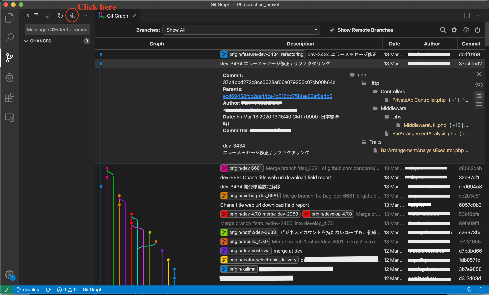

VSCode のおすすめプラグインについて、リストアップしていく記事です。

フロントエンド寄りの目線で書いています。

あと、今の会社に VSCode ユーザーが少ないので、VSCode 教の新規入信者に対して「これ入れておくといいよ」って言う用途にも使う予定です。

## [Bookmarks](https://marketplace.visualstudio.com/items?itemName=alefragnani.Bookmarks)

コードの特定の行をブックマークに登録しておいて、ボタン 1 つでブックマークまで飛べるようになるプラグインです。  
稀にとんでもない行数のコードに遭遇するようなことも IT 業界で働いているとありますが、そんなときでも楽々作業できます。

Mac の場合、以下の操作でコード行を登録して、ジャンプできます。

`cmd` + `opt` + `k`でブックマーク登録・解除。  
`cmd` + `opt` + `l`で次のブックマークへジャンプ。  
`cmd` + `opt` + `j`で前のブックマークへジャンプ。

## [REST Client](https://marketplace.visualstudio.com/items?itemName=humao.rest-client)

ところで、REST API を触る時に使うツールは何を使いますか？

有名どころを言えば、[Postman](https://www.postman.com/) でしょうか？  
（今までの職場、だいたい皆 Postman 使ってるところが多かったです）

でも、Postman ってインストールやら設定やらが面倒ではないですか？

ご安心ください。  
VSCode をお使いの方は、エディタ上から REST API を実行できます。

`.rest` の拡張子を持つファイルを作成し、そこに呼び出したい API の URL を書けば今すぐにでも使えます。

もちろん、Request header や Request Body などを設定して、認証などの情報を孵化した形での REST API を使用することもできます。

## [Live Share](https://marketplace.visualstudio.com/items?itemName=MS-vsliveshare.vsliveshare)

VSCode でペアプログラミングできるプラグイン。  
簡潔に言うと、VSCode を使った開発環境に他の VSCode ユーザーを招待して一緒に作業できるようになります。

リモートワークなどで物理的な距離が離れていても、VSCode と音声チャットツールさえあれば共同作業可能になります。

## [ESLint](https://marketplace.visualstudio.com/items?itemName=dbaeumer.vscode-eslint)

このプラグインを活用することで、ソースコードを保存した際に ESLint のルールに乗っ取って自動でソースコードを整形してくれます。  
こいつのおかげで、わざわざ ESLint のルールを確認してソースコードを修正する手間は限りなくなくなります。

プラグインをインストールした後に、設定を追加する必要があるのですが、[こちら](https://qiita.com/moriyuu/items/6bac1c75c61d9d359f96)を参考に設定してみてください。

## [Prettier - Code formatter](https://marketplace.visualstudio.com/items?itemName=esbenp.prettier-vscode)

ソースコードを自動整形してくれます。

CSS や SCSS、JSON の整形もできるのが地味に嬉しいところ。  
（CSS ってインデントが崩れてくることがよくありませんか？）

## [Remote SSH](https://marketplace.visualstudio.com/items?itemName=ms-vscode-remote.remote-ssh)

AWS EC2 などの環境にリモートで入り込んで作業できるプラグインです。

ローカル開発環境というものが存在しないスタートアップ、本番環境で作業する必要があるケース、EC2 で直に開発をしている職場などで非常に重宝します。

[使い方についての記事](ssh-remote-server-via-vscode/)は別途書きましたので、一読してもみてください。

## [Git Graph](https://marketplace.visualstudio.com/items?itemName=mhutchie.git-graph)

Git の変更履歴を見やすく綺麗に表示してくれるプラグインです。

`git log --oneline --graph --decorate` でそこそこ見やすくできるとはいっても、複雑になると意味不明になりますよね。

専用の GUI ツールなどを使ってもいいのですが、VSCode 使いならプラグインで解決できます。

そう VSCode ならね。
