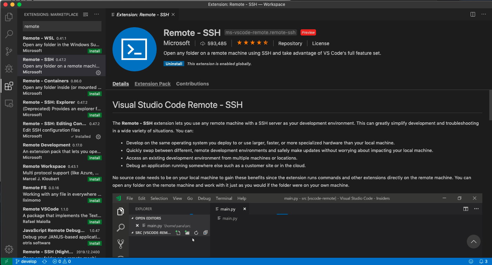
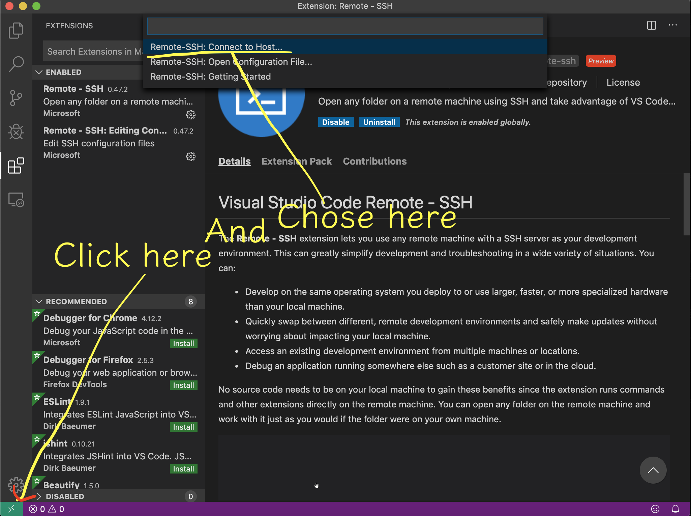
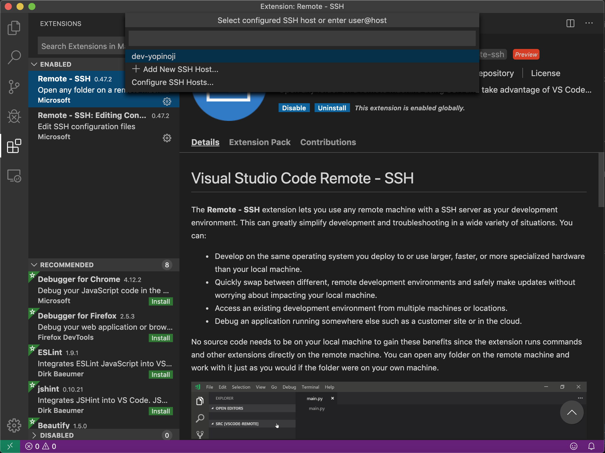
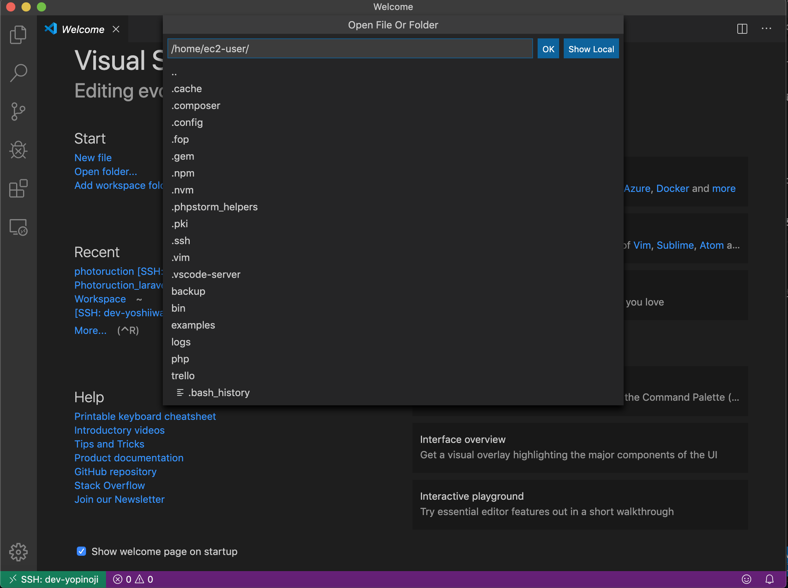

AWS の EC2 にあるプログラムを直で編集して開発する必要があったのですが、  
Visual Studio Code（VSCode）で EC2 に SSH してコード編集する方法が簡単かつ便利だったので共有です。

AWS の EC2 を使ってる前提で書いてますが、リモートサーバーのコードをエディタを使って編集したい用途なら何にでも活用できるはずです。

## 前準備

VSCode で SSH を使う前の準備段階として、SSH のコンフィグ（設定ファイル）を定義してあげる必要があります。

`.ssh/config`に SSH 接続先のリモートサーバーを定義を記述します。

以下はサンプルです。  
各自の環境に合わせて適宜書き換えてください。

```
Host yopinoji-com
    HostName yopinoji.com
    User ec2-user
    Port 22
    IdentityFile ~/.ssh/key.pem
```

上記のコンフィグを作成することで、`ssh yopinoji-com`とコマンド入力するだけで定義した環境に SSH 接続できるようになります。

SSH 接続に問題が無いようであれば前準備は完了です。

## VSCode で SSH できるようにする

それでは実施に VSCode で SSH 接続する手順です。

VSCode のプラグインとして提供されている、[Remote - SSH](https://marketplace.visualstudio.com/items?itemName=ms-vscode-remote.remote-ssh)をインストールします。



プラグインを検索する画面で「Remote」と入力すれば候補に出てくるはずです。

もし分からなければ、以下の URL からプラグインを手に入れられるはずです。  
https://marketplace.visualstudio.com/items?itemName=ms-vscode-remote.remote-ssh

プラグインのインストールが完了したら、VSCode から実際に使ってみましょう。



VSCode の左下を押下し後に、「Remote-SSH:Connect to Host...」と書かれた箇所を選択します。



「Remote-SSH:Connect to Host...」を選択すると、コンフィグに書かれた SSH 接続先が表示されるので、これを使って SSH 接続できます。



SSH 接続に成功すると、VSCode 左下が接続先になっているはずです。

あとは自由に SSH 接続先でフォルダを開いて編集するだけです。

## Tips

SSH 先で VSCode による開発行う際に役立つ情報をおまけとして載せておきます。

### SSH 先でコマンドライン操作を行う

Mac の場合、`control` + `shift` + `` ` `` で VSCode でのコマンドライン入力が行えるようになります。
SSH 先で入力することで SSH 先でのコマンドライン入力することが可能になります。

これが何を意味するのかというと、わざわざ Mac のターミナルから SSH 接続を行い SSH 先で操作を行う行為が一切不要になります。

開発環境で `npm run dev` するのも、Nginx のログを覗くのも、Laravel のログを覗くのも、全て VSCode 上で実行できるようになるのです。

超便利ですよ？

## 終わりに

今回、AWS の EC2 にあるコードをエディタから直接編集する目的で VSCode のプラグインを試してみましたが、  
少し設定を弄って、VSCode のプラグインを入れるだけなのでとても楽な上に便利でした。

また、時間が経つと SSH 接続が勝手に切れるということもなく、非常に使いやすいです。

リモートサーバーのコードを直接編集する用途なら本当にオススメなのでぜひ試してみてください。

## 参考

[Visual Studio Code Remote - SSH](https://marketplace.visualstudio.com/items?itemName=ms-vscode-remote.remote-ssh)
